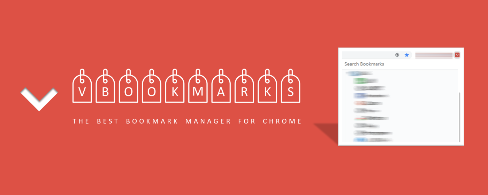
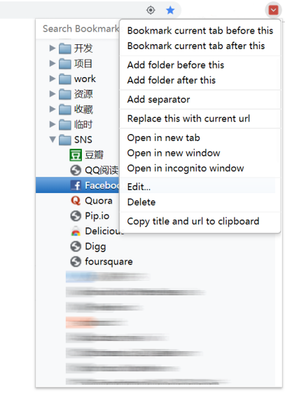

vBookmarks
==============

[English Readme](README.md) | [中文说明](README.zh.md)

 | 

[Available on WebStore](https://chrome.google.com/webstore/detail/vbookmarks/odhjcodnoebmndcihdedenkmdmklpihb)

[HomePage](http://windviki.github.com/vBookmarks/)

[All legacy versions](https://github.com/windviki/vBookmarks/blob/master/release/)

Modified from [Neat Bookmarks](https://github.com/cheeaun/neat-bookmarks), an excellent bookmark extension for Google Chrome. 

Inspired by "AddBookmarkHere" extension of Firefox, I added some new features to [Neat Bookmarks](https://github.com/cheeaun/neat-bookmarks), to provide more convenient way to manage booksmarks. After this, more other features are added. Many bugs found during the update of Chrome are solved. Now it has a new name "vBookmarks".

Licensed under the [MIT License](http://www.opensource.org/licenses/mit-license.php).

Read the [FAQ](https://github.com/windviki/vBookmarks/wiki/FAQ).

# New features (compared to [Neat Bookmarks](https://github.com/cheeaun/neat-bookmarks))

1) Bookmark current tab before selected bookmark/folder.

2) Bookmark current tab after selected bookmark/folder.

3) Bookmark current tab to the top of selected folder.

4) Bookmark current tab to the bottom of selected folder.

5) Add a sub-folder into selected folder.

6) Update URL of selected bookmark with current URL.

7) Copy title and URL information for selected bookmarks into clipboard.

8) Add an option: only show the nodes of the Bookmark Bar.

9) Add: Synchronizable bookmark separators.

10) Add: update checking and notification based on github. A tricky solution.

11) Fix bugs in [Neat Bookmarks](https://github.com/cheeaun/neat-bookmarks).

12) Search bookmark folders.

# Notes for Advanced Features

1. Search in Omnibox. Type * in your browser address bar, then press space key. Now you can input keyword to search in your bookmarks.

2. Full keyboard support. When the popup is open, you can change the selected bookmark/folder by using ↑↓←→, and you can open the focused one by SPACE or ENTER. Use ← key to unfold folder. Use HOME/END to go to the beginning or the end. PAGE DOWN/UP, DELETE are also supported just as their original meaning.

3. When the bookmark/folder is selected, press F2 to rename it.

4. Press middle button of mouse to open all bookmarks in focused folder.

5. When the popup is open, use Ctrl+F to show the search bar.

6. Darg & drop is supported. So you can rearrange your bookmarks.

7. You can decide whether to close popup after click-and-open the bookmark. You can found this option in settings.

8. You can only show bookmarks in Chrome bookmark bar. Also has a option to in settings.
   
9. Open bookmark in background. Also has a option to in settings.
    
10. Control the zoom level of bookmark popup in settings.
    
11. Advanced Settings: Custom the style of separators. The option is in "Advanced Settings", **you can found the entry at the right top of settings page**.

12. Advanced Settings: More flexible customization for the whole popup. CSS skill is required. e.g. You can change the font of the bookmark tree by: * {font-family: Consolas;}

13. Advanced Settings: Custom the icon of this extension.

# Technical Details

- [Neat Bookmarks](https://github.com/cheeaun/neat-bookmarks) was powered by [MooTools](http://mootools.net/), but is now powered by Neatools, a custom-coded smaller subset of MooTools. 
[CodeMirror](http://codemirror.net/) is used for the Custom CSS section.

- This is a successor of [Neat Bookmarks](https://github.com/cheeaun/neat-bookmarks). Thanks for [cheeaun](https://github.com/cheeaun)'s previous work.

# Changelogs

**ver1.0 2011/11/15**

First version.

**ver1.1 2011/11/16**

Added: option for only displaying bookmarks in Bookmark Bar.

Added: context menu for adding folder before/after bookmark/folder.

Fixed: some translations in multi-language support.

**ver1.2 2011/11/30**

Added: update selected bookmark with current URL.

Added: copy title and URL of selected bookmark to clipboard.

Fixed: after adding new bookmark or folder to a closed folder, its original children cannot be shown correctly. 

Fixed: make up some missing translations for cs(Czech).

**ver1.3 2012/05/25**

Fixed: Scrollbar glitch. https://github.com/windviki/vBookmarks/issues/1

**ver1.4 2012/06/20**

Fixed: Scrollbar problem in Chrome 18,19. https://github.com/windviki/vBookmarks/issues/2

**ver1.5 2012/06/21**

Fixed: manifest problem in Chrome 20+.

Fixed: separated script file instead of inline scripts. see Content Security Policy http://code.google.com/chrome/extensions/contentSecurityPolicy.html

**ver1.6 2012/06/24**

Fixed: Cannot search bookmarks in Omnibox (*+space). [Content Security Policy]

Fixed: Restore width of the popup window. [Content Security Policy]

Fixed: Dialogs cannot submit their forms. [Content Security Policy]

**ver1.7 2012/06/26**

Fixed: Double scrollbars in Chrome 19. Sorry for the previous untest release. I do not have many different Chromes in different versions :)

Fixed: Width resetting occured when expanding root folder. https://github.com/windviki/vBookmarks/issues/2

**ver1.8 2012/08/01**

Added: Separators for bookmarks/folders. But it is a local record and cannot be synchronized between different devices. see https://github.com/windviki/vBookmarks/issues/3

Fixed: Neatbookmarks bug: Wrong position of dragged bookmark when vertical scrollbar is scrolled down (since Chrome18).

Added: Color of icon is changed to red.

Added: Simple update checking and desktop notification.

Removed: Several languages. Only 4 locales are left: en, ja, zh, zh_TW. Cannot maintain many translations any more.

**ver1.9 2012/08/19**

Fixed: Neatbookmarks bug: Scrollbar will be reset to the top when opening and scrolling the popup down.

Updated: Color of ICON.

Updated: Style of separator.

**ver2.0 2012/11/01**

Fixed: Version checking in background.js.

Improved: Synchronizable separators.

Added: Advanced options for separator.

- "The real title of bookmark which is shown as a separator": By default it is "|". That means the separators you added in vbookmarks will be shown as a normal bookmark in Chrome bookmark manager or bookmark menu, with this title value. You can modify it to "------------" so that you can split your bookmarks horizontally even if you check your bookmarks in Chrome bookmark menu.

- "The real URL of bookmark which is shown as a separator": By default it is "http://separatethis.com/". It's a "online separator". The separators you added in vbookmarks will be shown as a normal bookmark in Chrome bookmark manager or bookmark menu, with this URL value.

- "If URL of a bookmark contains this string, it will be shown as a separator": If you set this value (you can set several URLs joined by ";"), all bookmarks whose URL contains any of them will be shown as real separators in vbookmarks. e.g. if you set it to google.com, all google services in your bookmarks will be shown as separators.

**ver2.1 2012/12/12**

Fixed: Now it can remember and restore position of scroll bar correctly.

Improved: Position of context menu. And context menu will be dismissed when scrolling up/down.

Added: Cancel button for dialogs in vbookmarks.

**ver2.2 2013/04/02**

Fixed: Scroll bar does not work above chrome 26+ (not well tested).

**ver2.3 2013/04/09**

Fixed: Context menu will be dismissed when scrolling up/down (broken again in previous version).

Fixed: Remember position of scroll bar (broken again in previous version).

**ver2.4 2013/08/29**

Fixed: "Unexpected end of input" in js.

**ver2.5 2013/08/30**

Fixed: Remove HTML notifications because it is not available now. https://bugs.webkit.org/show_bug.cgi?id=98388.

**ver2.6 2013/10/21**

Fixed: Remove double scroll bars.

**ver2.8 2019/05/06**

Fixed: Open URL twice when clicked by middle button of mouse. https://github.com/windviki/vBookmarks/issues/9

Fixed: Sometimes search will fail. https://github.com/windviki/vBookmarks/issues/7

Fixed: Context menu position.

Improved: Scrollbar CSS style.

Added: Placeholder "\_\_VBM_CURRENT_TAB_URL\_\_" in bookmark URL to make some bookmarklets work (Chrome does not allow _document.location.href_ in BMlet). It will be replaced with URL of current active tab when you click BMlet from vBookmarks.

**ver2.9 2019/08/22**

Fixed: Double scrollbar since Chrome version 77+.

**ver3.0 2019/08/22**

Fixed: New icons.

**ver3.1 2020/07/03**

Fixed: [#12](https://github.com/windviki/vBookmarks/issues/12): Focus lost when clear the menu.

Fixed: [#18](https://github.com/windviki/vBookmarks/issues/18): Tree does not scroll when drag to top or bottom.

Fix an undefined error when pressing key DOWN.

Fix the support of bookmarklet. Thanks for @ZG-nico.

Added: France language. Thanks for @Fab-fr.

Added: Chinese Hong Kong language.

**ver3.2 2020/09/12**

Fixed: [#19](https://github.com/windviki/vBookmarks/issues/19): "Add to the end of folder" feature does not work bugs.

New: [#15](https://github.com/windviki/vBookmarks/issues/15): Search for folders in bookmark search bar.

New: Resize the height of popup.

Added: Italy language.

Added: Russian language. Thanks for @Stanislav .

Fix some undefined errors.

Update code to ecmascript version 6. minimum_chrome_version = 61.

**ver3.3 2023/02/02**

Fixed: [#23](https://github.com/windviki/vBookmarks/issues/23): Incorrect link on the options page.

Fixed: [#26](https://github.com/windviki/vBookmarks/issues/26): Middle/Ctrl click no longer opens bookmarks in the background in Chrome 107.

New: [#24](https://github.com/windviki/vBookmarks/issues/24): Add new option to disable incremental search (use ENTER to search).

Fixed: The stupid double scroll bar (finally).

Fixed: Focus lost when quit from search mode.

Fixed: Arrow down triggers an error in search mode.

Fix some undefined errors.

Update code to manifest V3. minimum_chrome_version = 88.

**ver3.4 2023/02/14**

Fixed: [#26](https://github.com/windviki/vBookmarks/issues/26): open directory in the background.

New: Key Right to open context menu (when focus on an opened dir or a bookmark) and key Left to close it (when context menu is showing).

Remove timeout of height reset. Speed up the popup.

**ver3.5 2023/09/04**

Fixed: [#29](https://github.com/windviki/vBookmarks/issues/29): cursor focus doesn't stay in search bar after clearing the search text.

Fix shortcut in manifest. Now the default shortcut is Ctrl+Shift+V (Ctrl+Shift+B cannot work in new Chrome.)

# Attentions

For those who installs the pre-built crx file:

Above Chrome 20+, please drag this crx file to chrome://chrome/extensions/ to install it.

Above Chrome 22+, please add startup parameters (--enable-easy-off-store-extension-install) for Chrome.exe so that it can accept extensions which are from outside of the WebStore.

See [link](http://www.howtogeek.com/120743/how-to-install-extensions-from-outside-the-chrome-web-store/) for details.

Available on [WebStore](https://chrome.google.com/webstore/detail/vbookmarks/odhjcodnoebmndcihdedenkmdmklpihb). It's the recommended way to use this extension.
