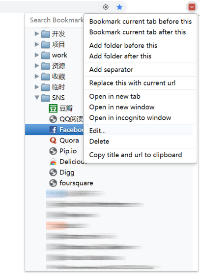

vBookmarks
==============

[English Readme](README.md) | [中文说明](README.zh.md)

[](../donation/donation.md) | [](../donation/donation.zh.md)


[Chrome 应用商店安装](https://chrome.google.com/webstore/detail/vbookmarks/odhjcodnoebmndcihdedenkmdmklpihb) · [主页](http://windviki.github.com/vBookmarks/)

**vBookmarks** 是一个快速、键盘优先的 Chrome 书签管理器，住在工具栏弹窗里，也可以搬进 Chrome 侧边栏。它源自优秀的 [Neat Bookmarks](https://github.com/cheeaun/neat-bookmarks)，十余年持续打磨：层级书签树、即时模糊搜索、右键菜单、拖拽排序、分隔线，以及一套现代化、可换肤的界面。

基于 [MIT 协议](http://www.opensource.org/licenses/mit-license.php)开源。常见问题见 [FAQ](https://github.com/windviki/vBookmarks/wiki/FAQ)。


# 为什么选择 vBookmarks

- **现代而克制的界面** —— 完整的设计令牌体系，五种外观：跟随系统、亮色、暗色，外加两个精心调制的 fable 主题：**Ink（墨色）** 与 **Paper（纸感）**。
- **随手即达** —— fzf 风格模糊搜索，命中字符高亮（对中日韩友好）；**命令面板**（`Ctrl/Cmd+K`）统一了书签搜索、文件夹跳转与高级命令。
- **内置效率工具** —— 重复书签清理（`/dupes`）、死链扫描（`/dead`）、会话保存（`/session`），每次删除都有一键撤销。
- **快速收藏无处不在** —— 弹窗星标按钮、`Ctrl/Cmd+D`、页面右键菜单"收藏此页"。
- **同步状态感知** —— Chrome 138+ 的双存储（本地/已同步）下，仅本地子树会柔和淡显，根文件夹标注`（仅本地）`/`（已同步）`；跨存储拖拽用温和的 toast 提示代替生硬的失败。
- **43 种语言**，全部与英文基准对齐，由 LLM 辅助的翻译流水线持续同步。
- **隐私无忧** —— 纯 ES6+ JavaScript，无框架、无构建、无遥测；你看到的源码就是你运行的代码。


# 功能亮点

1. 把当前页收藏到选中书签/文件夹的前后，或文件夹的顶部/底部。
2. 添加子文件夹；用当前页 URL 更新书签；一键复制标题 + URL。
3. 最近添加区：树顶部展示最近 20 条新书签，可折叠，也可在选项中关闭。
4. 文件夹内容排序：按标题或日期，可选文件夹优先、可选递归。
5. 可同步的书签分隔线，样式可自定义。
6. 真正的主题系统：亮 / 暗 / 跟随系统 / Ink / Paper，共享设计令牌。
7. 可选侧边栏模式（选项开启，弹窗仍是默认），快捷键 `Alt+Shift+B`。
8. 命令面板（`Ctrl/Cmd+K`，全局 `Ctrl/Cmd+Shift+K`）与地址栏搜索：输入 `*` 加空格。
9. 完整键盘操作与拖拽排序。
10. 克制的同步状态呈现：已同步行保持安静，只有"仅本地"与"无法同步"才有标记。





# 4.0 新变化

**体验**

- 搜索框修复并现代化：消除点击穿透的死区；新增自定义清除按钮，有内容时稳定出现。
- 向折叠文件夹添加书签/文件夹/分隔线立即可见：文件夹自动展开并展示新节点（此前需要重开弹窗才能看到）。
- "复制标题和 URL"恢复可用 —— 迁移到异步 Clipboard API（新增 `clipboardWrite` 权限），旧的 `execCommand('copy')` 在脱离用户手势后会被 Chrome 静默拒绝。
- 同步呈现重做：绿点噪音反转（已同步行保持安静）、tooltip 本地化、双存储根标注`（仅本地）`/`（已同步）`、跨存储拖拽拦截改为 toast（原来用会摧毁弹窗的 `alert()`）、沉睡已久的"高亮未同步"选项真正生效（仅本地子树淡显）。

**平台与代码**

- 目录结构 v4 重组：第一方 JS 在 `src/`、页面在 `pages/`、样式在 `css/`、图片分为 `assets/icons`（随包发布）与 `assets/store` + `assets/design`（不发布）；过时产物（旧 `release/*.crx`、MV2 遗留）已删除，留存于 git 历史。
- 全量内联 SVG 图标（文件夹、bookmarklet、展开箭头、搜索、星标），位图树图标退役。
- 661 个单元测试（Vitest）覆盖全部模块；Docker 无头冒烟 + 截图 harness，含多语言界面截图。
- 统一语言工具（`scripts/i18n.py`）：键使用审计、与英文基准的差异报告、LLM 批量翻译、带菜单长度警告的 verify 门禁。基准键从 75 增至 139，43 个语种全部对齐。


# 高级功能说明

1. **地址栏搜索** —— 输入 `*` 加空格，即可搜索书签。
2. **完整键盘支持**，树视图与命令面板（`Ctrl/Cmd+K`）均可用：
   - **↑↓** 移动选项，**←→** 打开 / 关闭右键菜单
   - **Enter** / **Space** 打开选中书签；**Ctrl/Cmd+Enter** 在新标签页打开
   - **Home** / **End** 跳转到首 / 尾项
   - **PageUp** / **PageDown** 翻页滚动
   - **Delete** 删除选中的书签或文件夹
   - 键入过滤：直接输入关键字实时筛选（命令面板中自动聚焦搜索框）
3. 选中书签/文件夹后按 `F2` 重命名。
4. 中键点击文件夹，在新标签组中打开其全部书签（自动配色）。
5. `Ctrl+F` 聚焦搜索框，`Esc` 分层退出：清除搜索 → 关闭右键菜单 → 关闭命令面板 → 关闭弹窗。
6. **命令面板**（弹窗内 `Ctrl/Cmd+K`，全局 `Ctrl/Cmd+Shift+K`）：
   - 模糊搜索书签和文件夹、跳转到树中的文件夹、或执行斜杠命令
   - 斜杠命令：`/dupes` 查找重复书签，`/dead` 扫描死链，`/session` 保存当前窗口标签页
   - 完整键盘导航与树视图一致（↑↓←→、Enter、Home/End、Delete、F2）
7. 拖拽排序；跨同步/本地存储的拖拽会被安全拦截并给出提示。
8. 可设置点击书签后是否关闭弹窗。
9. 可只显示书签栏内容（选项中开启）。
10. 可设置后台标签页打开书签。
11. 选项中可调节弹窗缩放级别。
12. **高级设置**（入口在设置页右上角）：自定义分隔线的标题/URL/样式。
13. **高级设置**：自定义整个弹窗的 CSS（CodeMirror 编辑器），例如 `* { font-family: Consolas; }`。
14. **高级设置**：替换扩展工具栏图标。
15. 可关闭弹窗高度自动调整，保持固定高度。


# 开发指南

无构建步骤 —— 在 `chrome://extensions/` 中**加载已解压的扩展程序**，选择仓库根目录即可。

```bash
# 单元测试（Vitest，23 个测试文件共 677 例）
npm install
npm run test:run

# 无头冒烟 + 截图 harness（Docker；截图输出到 tmp/shots/）
scripts/screenshots/run.sh                # 冒烟 + 全部套件
scripts/screenshots/run.sh --smoke-only   # 仅零控制台错误检查
#   shots.js         交互状态（亮/暗主题）
#   shots-themes.js  Ink + Paper 主题
#   shots-i18n.js    树/右键菜单/编辑对话框/选项页 × 8 种界面语言

# 语言流水线（scripts/i18n.py，仅标准库）
python3 scripts/i18n.py audit      # 代码中使用的键 vs 英文基准
python3 scripts/i18n.py missing    # 各语种缺失 / [TODO] 报告
python3 scripts/i18n.py translate --apply   # LLM 批量翻译
python3 scripts/i18n.py verify     # 门禁：键对齐、TODO、菜单长度
# translate 从 git 忽略的仓库根 .env 读取 LLM 端点配置：
#   VBM_LLM_API_KEY=...  VBM_LLM_BASE_URL=...  VBM_LLM_MODEL=...
#   VBM_LLM_API_TYPE=openai|anthropic_messages

# 发布打包（版本号读自 manifest.json）
python3 scripts/package.py         # → tmp/vBookmarks_<版本>.zip
```

`tmp/` 与 `.env` 已被 git 忽略。新增运行时文件时请同步 `scripts/package.py` 的文件清单；完整的协作者指南见 `AGENTS.md`。


# 技术细节

- 纯 ES6+ JavaScript（无框架、无打包器）；[CodeMirror](http://codemirror.net/) 支撑自定义 CSS 编辑器。
- [Neat Bookmarks](https://github.com/cheeaun/neat-bookmarks) 的继任者 —— 感谢 [cheeaun](https://github.com/cheeaun) 的开创性工作。
- 4.0 之前的旧发布物（`release/*.crx`）已从工作区移除，仍可在 git 历史中获取。


# 更新日志

**ver4.0 2026/07/18**

新增：Ink 与 Paper 双 fable 主题；命令面板（`Ctrl/Cmd+K`）；快速收藏星标按钮；可折叠的最近添加区；同步状态呈现重做（安静圆点、本地化 tooltip、`（仅本地）`/`（已同步）`根标注、拖拽拦截 toast、"高亮未同步"淡显生效）。

修复：搜索框点击穿透与原生清除按钮不可靠（新增自定义清除按钮）；向折叠文件夹添加内容立即可见；复制标题/URL 改用异步 Clipboard API（新增 `clipboardWrite` 权限）。

变更：仓库目录重组（`src/`、`pages/`、`css/`、`assets/`、`scripts/`）；删除过时 `release/` 与 MV2 遗留（留存 git 历史）；图标全量内联 SVG；语言基准增至 139 键，43 个语种经新 `scripts/i18n.py` LLM 流水线重新对齐；测试增至 661 例；Docker 冒烟 + 截图 harness 扩展多语言截图。


**ver3.7 2026/05/10**

新增：[#36](https://github.com/windviki/vBookmarks/issues/36)：弹窗高度自动调整开关（常规设置）。

修复：[#42](https://github.com/windviki/vBookmarks/issues/42)：Chrome 148 弃用 `<command>` 元素导致扩展失效，改用 `<div>` 完全兼容。

新增：自 cc-dev 分支同步的 42 语言支持，全部对齐英文基准（75 键）：ar, bg, bn, cs, da, de, el, en, es, et, fa, fi, fr, he, hi, hr, hu, id, it, ja, ko, lt, lv, mk, nl, no, pl, pt, pt_BR, pt_PT, ro, ru, sk, sl, sv, th, tr, uk, vi, zh, zh_HK, zh_TW。


**ver3.6 2024/01/08**

修复：[#31](https://github.com/windviki/vBookmarks/issues/31)：自定义图标失效。


**ver3.5 2023/09/04**

修复：[#29](https://github.com/windviki/vBookmarks/issues/29)：清除搜索文本后光标焦点不保留在搜索框。

修复 manifest 快捷键。默认快捷键现为 Ctrl+Shift+V（Ctrl+Shift+B 在新版 Chrome 不可用）。


**ver3.4 2023/02/14**

修复：[#26](https://github.com/windviki/vBookmarks/issues/26)：后台打开文件夹。

新增：方向键右键打开上下文菜单（焦点在已打开文件夹或书签上时），左键关闭菜单。

移除高度重置延时，加快弹窗速度。


**ver3.3 2023/02/02**

修复：[#23](https://github.com/windviki/vBookmarks/issues/23)：选项页链接错误。

修复：[#26](https://github.com/windviki/vBookmarks/issues/26)：Chrome 107 中中键/Ctrl 点击不再后台打开书签。

新增：[#24](https://github.com/windviki/vBookmarks/issues/24)：新增关闭即时搜索的选项（按 ENTER 搜索）。

修复：愚蠢的双滚动条（终于）。

修复：退出搜索模式时焦点丢失。

修复：搜索模式下方向键下报错。

修复若干 undefined 错误。

升级至 Manifest V3，minimum_chrome_version = 88。


**ver3.2 2020/09/12**

修复：[#19](https://github.com/windviki/vBookmarks/issues/19)：「添加到文件夹末尾」功能失效。

新增：[#15](https://github.com/windviki/vBookmarks/issues/15)：搜索栏支持搜索文件夹。

新增：弹窗高度调整。

新增：意大利语。

新增：俄语，感谢 @Stanislav。

修复若干 undefined 错误。

升级至 ECMAScript 6，minimum_chrome_version = 61。


**ver3.1 2020/07/03**

修复：[#12](https://github.com/windviki/vBookmarks/issues/12)：清除菜单时焦点丢失。

修复：[#18](https://github.com/windviki/vBookmarks/issues/18)：拖拽到顶部/底部时树不滚动。

修复按下方向键时的 undefined 错误。

修复 bookmarklet 支持，感谢 @ZG-nico。

新增：法语，感谢 @Fab-fr。

新增：中文（香港）。


**ver3.0 2019/08/22**

修复：新图标。


**ver2.9 2019/08/22**

修复：Chrome 77+ 双滚动条。


**ver2.8 2019/05/06**

修复：中键点击重复打开 URL。https://github.com/windviki/vBookmarks/issues/9

修复：搜索偶发失败。https://github.com/windviki/vBookmarks/issues/7

修复：右键菜单位置。

改进：滚动条 CSS。

新增：书签 URL 占位符 "\_\_VBM_CURRENT_TAB_URL\_\_"，让部分 bookmarklet 可用（Chrome 不允许 bookmarklet 中的 _document.location.href_）。从 vBookmarks 点击时会替换为当前活动标签页 URL。


**ver2.6 2013/10/21**

修复：移除双滚动条。


**ver2.5 2013/08/30**

修复：移除 HTML 通知（已不可用）。https://bugs.webkit.org/show_bug.cgi?id=98388


**ver2.4 2013/08/29**

修复：js 中 "Unexpected end of input"。


**ver2.3 2013/04/09**

修复：上下滚动时右键菜单未关闭（上一版回归）。

修复：滚动条位置记忆（上一版回归）。


**ver2.2 2013/04/02**

修复：Chrome 26+ 滚动条失效（测试不足）。


**ver2.1 2012/12/12**

修复：正确记忆并恢复滚动条位置。

改进：右键菜单位置；上下滚动时菜单会关闭。

新增：对话框取消按钮。


**ver2.0 2012/11/01**

修复：background.js 版本检查。

改进：可同步的分隔线。

新增：分隔线高级选项。


- 「作为分隔线显示的书签的真实标题」：默认为 "|"。即你在 vBookmarks 中添加的分隔线，在 Chrome 书签管理器或书签菜单中会以该标题显示为普通书签。可改为 "------------"，这样在 Chrome 书签菜单中也能起到分隔作用。


- 「作为分隔线显示的书签的真实 URL」：默认为 "http://separatethis.com/"。即"在线分隔线"。


- 「URL 包含此字符串的书签将显示为分隔线」：可设置多个 URL 以 ";" 连接，所有 URL 包含其中任一字符串的书签都会在 vBookmarks 中显示为分隔线。例如设为 google.com，所有 Google 服务都会显示为分隔线。


**ver1.9 2012/08/19**

修复：Neat Bookmarks 缺陷：打开弹窗并向下滚动后滚动条会回到顶部。

更新：图标颜色。

更新：分隔线样式。


**ver1.8 2012/08/01**

新增：书签/文件夹分隔线。本地记录，暂不支持多设备同步，见 https://github.com/windviki/vBookmarks/issues/3

修复：Neat Bookmarks 缺陷：滚动条向下滚动后拖拽书签位置错误（Chrome18 起）。

新增：图标颜色改为红色。

新增：简单的更新检查与桌面通知。

移除：部分语言，仅保留 4 个 locale：en, ja, zh, zh_TW。无力维护更多翻译。


**ver1.7 2012/06/26**

修复：Chrome 19 双滚动条。为之前未经测试的发布抱歉，我没有多个版本的 Chrome :)

修复：展开根文件夹时宽度重置。https://github.com/windviki/vBookmarks/issues/2


**ver1.6 2012/06/24**

修复：地址栏无法搜索书签（*+空格）。[内容安全策略]

修复：恢复弹窗宽度。[内容安全策略]

修复：对话框无法提交表单。[内容安全策略]


**ver1.5 2012/06/21**

修复：Chrome 20+ manifest 问题。

修复：独立脚本文件替代内联脚本，见内容安全策略 http://code.google.com/chrome/extensions/contentSecurityPolicy.html


**ver1.4 2012/06/20**

修复：Chrome 18、19 滚动条问题。https://github.com/windviki/vBookmarks/issues/2


**ver1.3 2012/05/25**

修复：滚动条故障。https://github.com/windviki/vBookmarks/issues/1


**ver1.2 2011/11/30**

新增：用当前 URL 更新选中书签。

新增：复制选中书签的标题和 URL 到剪贴板。

修复：向关闭的文件夹添加新书签或文件夹后，原有子项无法正确显示。

修复：补齐 cs（捷克语）缺失的翻译。


**ver1.1 2011/11/16**

新增：只显示书签栏书签的选项。

新增：在书签/文件夹前后添加文件夹的右键菜单。

修复：多语言支持中的部分翻译。


**ver1.0 2011/11/15**

首个版本。


# 注意事项

推荐从源码（"加载已解压的扩展程序"）或应用商店安装。旧版 crx 侧载说明：Chrome 20+ 请将 crx 拖入 `chrome://chrome/extensions/`；Chrome 22+ 需添加启动参数 `--enable-easy-off-store-extension-install` 以安装商店外扩展（见[说明](http://www.howtogeek.com/120743/how-to-install-extensions-from-outside-the-chrome-web-store/)）。

[Chrome 应用商店](https://chrome.google.com/webstore/detail/vbookmarks/odhjcodnoebmndcihdedenkmdmklpihb)是推荐的使用方式。
