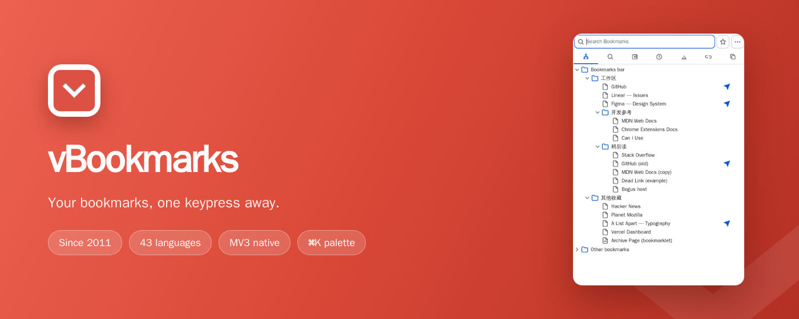
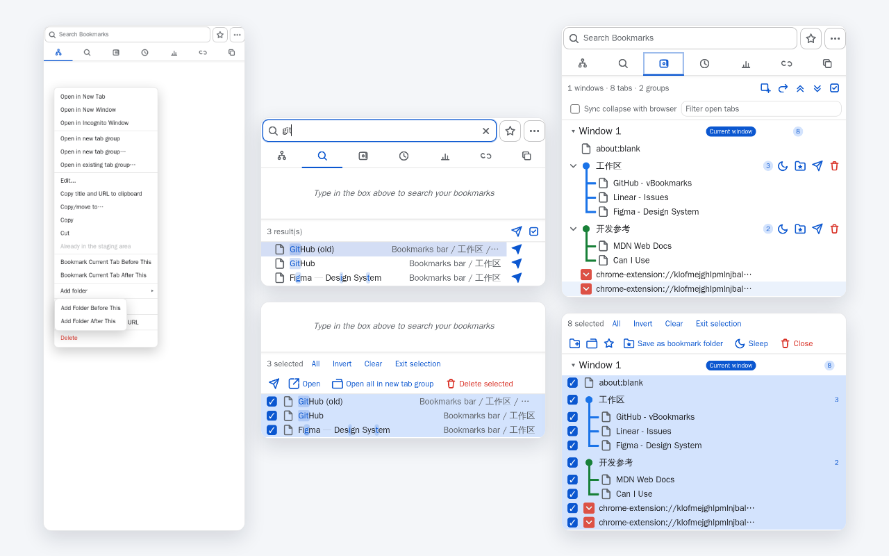

vBookmarks
==============

[English Readme](README.md) | [中文说明](README.zh.md)

[](../donation/donation.md) | [](../donation/donation.zh.md)



[Chrome 应用商店安装](https://chrome.google.com/webstore/detail/vbookmarks/odhjcodnoebmndcihdedenkmdmklpihb) · [主页](http://windviki.github.com/vBookmarks/)

**vBookmarks 把你的书签堆变成一个快速、键盘优先的工作台。** 点击工具栏图标，弹窗里是一个七视图管理器（也可以搬进 Chrome 侧边栏，随你选）：熟悉的文件夹树、即时模糊搜索、标签组、暂存区工作台（最近添加列表折叠在其中）、访问统计、死链扫描器、重复清理器。一切皆可键盘完成，每次删除都能撤销，数据不出浏览器——没有账号、没有遥测、没有构建黑盒，只有你读得懂的纯 JavaScript。

- **七个视图，一个弹窗** —— 树 / 搜索 / 标签组 / 暂存（含最近添加列表）/ 统计 / 死链 / 重复，图标 tab 条切换，或 `Alt+1…7` 直达。
- **书签库的保养队** —— 死链扫描可暂停续扫；重复清理六种保留策略、批量删除可撤销；整个窗口的标签页一键存为会话文件夹。
- **真·键盘优先** —— 每个视图都能脱离鼠标完整操作：方向键、`Enter`、`F2` 重命名、`Delete`、视图快捷键，外加 `Ctrl/Cmd+K` 命令面板。
- **快而安静** —— fzf 风格模糊搜索、命中高亮（对中日韩友好）；地址栏 `*` + 空格搜书签；同步状态指示克制不吵。
- **随你打扮** —— 五套精制主题、自定义 CSS、自定义工具栏图标、单视图显隐开关——也可以整条隐藏 tab 条，回到经典单栏模样。
- **隐私为先** —— 数据全本地，43 种语言，MIT 开源。
- **Chrome 与 Edge 通吃** —— 同一个 MV3 包两款浏览器都能装（`npm run package` 构建 `dist/` 并产出商店 zip；`python3 scripts/package.py --target edge` 直接出源码 zip；Firefox 需要构建步骤，评估见 [browser-compat.md](browser-compat.md)）。

基于 [MIT 协议](http://www.opensource.org/licenses/mit-license.php)开源。常见问题见 [FAQ](https://github.com/windviki/vBookmarks/wiki/FAQ)。4.0 新特性上手请读 [v4 功能指南](guide-v4.zh.md)。


# 为什么选择 vBookmarks

- **现代而克制的界面** —— 完整的设计令牌体系，五种外观：跟随系统、亮色、暗色，外加两个精心调制的 fable 主题：**Ink（墨色）** 与 **Paper（纸感）**。
- **随手即达** —— fzf 风格模糊搜索，命中字符高亮（对中日韩友好）；可重跑的搜索历史；**命令面板**（`Ctrl/Cmd+K`）统一了书签搜索、文件夹跳转、视图跳转与高级命令。
- **内置效率工具** —— 双通道死链扫描（可暂停/恢复）、六种保留策略的重复清理（批量删除走撤销链）、会话保存，每次删除都有一键撤销。
- **快速收藏无处不在** —— 弹窗星标按钮、`Ctrl/Cmd+D`、全局快捷键 `Alt+Shift+S`、页面右键菜单"收藏此页"。
- **同步状态感知** —— Chrome 138+ 的双存储（本地/已同步）下，仅本地子树柔和淡显，根文件夹标注`（仅本地）`/`（已同步）`；跨存储拖拽用温和的 toast 提示代替生硬的失败。
- **43 种语言**，全部与英文基准对齐，由 LLM 辅助的翻译流水线持续同步。
- **隐私无忧** —— 纯 ES6+ JavaScript，无框架、无遥测；开发无需构建步骤（发布包由 `dist/` 经 `npm run build` 构建）。访问统计只存在本地，一个开关停采、一个按钮清空。


# 4.0 新变化

4.0 是项目史上最大的一次发布。弹窗被重构为**视图系统**——图标 tab 条后的七个专业视图——而经典的书签树体验只需一个设置就能回来。

## 视图系统

- **七个视图**：**树**（经典）、**搜索**、**标签组**、**暂存/最近**、**统计**、**死链**、**重复**。图标 tab 条带实时计数角标（死链标记数、重复组数、已统计页面数）；每个功能视图（标签组/暂存/统计/死链/重复）都可单独隐藏——甚至彻底禁用——整条 tab 条也可隐藏，回到经典单栏布局。
- **全视图同一套键盘模型** —— 树视图成熟的方向键语义（↑↓、`Home`/`End`、`PageUp`/`PageDown`、`Enter`、`F2`、`Delete`、键入过滤）在每个列表视图完全一致；首行再按 `↑` 逐级上到 tab 条、再到搜索框；tab 条本身支持 ←/→/Home/End 漫游焦点与 RTL 感知；`Alt+1…7` 直达视图（Chrome 与 Edge 通用的写法——Edge 把 `Ctrl+1…8` 保留给了自己的标签页切换）。
- **分层 `Esc`** —— 右键菜单 → 命令面板 → 视图级动作（如暂停扫描）→ 清空搜索 → 回到树 → 关闭弹窗，一次只剥一层。
- **弹窗与侧栏分工** —— 两者默认都在你上次离开的视图重新打开（弹窗靠的是默认开启的"记住上次所在的视图"开关，关掉则总是从树启动）；侧边栏随时可以变成常驻的书签工作台。

## 搜索视图——双区结构

- 弹窗搜索长大成独立视图：**上区历史、下区结果**，两区同屏共存。
- **搜索历史**（MRU 10 条）只记录真正用过的查询——按 `Enter`、打开结果、或离开视图时——带结果数与相对时间。点击或按 `Enter` 重跑，`Delete` 或右键菜单单条移除/清空；设置里关掉历史会立即停记并清空存量。
- 离开再回来，搜索框、结果列表、滚动位置全部原样留存——不重排、不重查。

## 标签组视图

- **浏览器会话一屏尽收**：每个窗口的标签页按真实顺序列出——已入组的嵌在各自的 Chrome 标签组下（组名、颜色、成员数），未分组的按序平铺，当前标签有标记。在这里折叠一个组，浏览器里的组也随动收起（可选的联动开关）。
- **不离开弹窗完成标签管理**：激活、固定/取消固定、睡眠/唤醒、关闭、拖拽排序——按单个标签或整组操作，行内按钮、右键菜单、键盘三条路都通。
- **批量处理的选择模式**：把选中标签组成新标签组、并入已有标签组、批量关闭或睡眠；选中的标签若已属于某个组，会给出**复制**（在新位置重开）或**移动**（脱离原组）的选择。
- **标签与书签互通**：一键把标签收进快速添加文件夹；整组可存为书签文件夹并记住组的颜色与标题，日后"打开为新标签组"时原样恢复。
- **最近关闭的组**列在底部（深度 5–50 可调）：整组重开，或逐个标签恢复/加书签/移除。

## 暂存 / 最近视图

- 旧的树内"最近添加"区长成了**暂存工作台**——一张留给"还没想好放哪"的链接的草稿桌（完整走查见 [v4 功能指南](guide-v4.zh.md) §3.3）。行是双态的：实心 ★ 表示已收藏，描边 ☆ 表示只是暂存。分组由你搭建——行可在组间拖拽、组头可拖拽重排——选择模式可批量打开 / 收藏 / 分组 / 移动 / 复制 / 删除 / 移出暂存区；破坏性操作都留有撤销 toast。
- 最新书签仍按**今天 / 本周 / 本月 / 更早**粗分组，每行右侧相对时间徽章，第二行 `路径 · 精确时间`。
- 按 `R`（或右键）在树中定位；可选地从 Chrome 历史一次性回填更早的访问（默认关闭，仅在你主动开启时请求权限）。

## 统计视图——你的真实使用

- **访问统计，100% 本地**：从弹窗打开的书签会被计数；后台采集器还会捕捉你从地址栏等其它入口打开书签 URL 的导航（去重协议保证一次打开不计两次）。
- 按**次数**或**最近**排序（选择持久化）；一个 ConfirmDialog 确认的按钮清空全部；关掉 `statsEnabled` 即彻底停采，清除出口始终可达。
- **最近访问**分区列出 Chrome 记录的真实访问：已收藏的带 ★ 徽章，未收藏的一键 ☆ 收入书签。

## 死链视图

- **双通道检测**：直连优先；失败时由第二通道终判——"对全世界都挂了"和"只是这里被墙"是不同的徽章。第二通道可以在列表上方的代理条里**一键添加你自己的代理服务器**（http/https/socks5，保存前先做可达性探测，不可达不保存），也可以沿用选项页的中继 URL 模板。
- **代理机制，边界透明**：走代理的探测由一段临时 PAC 脚本路由，它只匹配扫描器自己带标记的探测 URL——其他标签页的流量保持原路径，扫描结束、取消或弹窗关闭时设置即刻还原。`proxy` 权限在安装时声明（Chrome 不允许把它列为可选权限）；**只要你没有配置代理服务器、或从不使用死链扫描，该权限完全不会被使用**——不会执行任何代理相关代码路径。**已知冲突**：个别代理/加速类扩展（如 iGuge）会主动禁用任何声明了 `proxy` 权限且不在其白名单中的已启用扩展——核实的根因与受影响用户的处理办法见 [issue #53/#57 分析](issues/issue-53-57-iguge-conflict.md)。
- **渐进呈现、可暂停、且比弹窗长寿的扫描**：扫描跑在 service worker 里——中途关掉弹窗或侧边栏进度不丢，重开即见实时镜像，被打断的扫描还会自行续跑。结果逐行流入；`Esc` 暂停/续扫不丢进度；取消会回退到上次完成的快照。进度刷新是静默的，绝不动你的滚动位置。
- **首次清理前的风险横幅**（死链与去重都会批量改写书签）附 Chrome 官方备份与恢复说明的链接；"不再提示"后到下一个 major 或 minor 版本前都不再出现（patch 静默更新不弹）。
- 并发（1–16）与超时（2–30 秒）可调；死链/受阻/全部三态过滤附死链·受限计数；**死链标记**——标一次，红色 ✕ 会跟着这条书签出现在树、搜索、最近、统计所有视图里。

## 重复视图

- 找的是真重复，不是字符串相等：归一化先于分组（剥掉 `utm_*`/`fbclid`/`gclid` 等跟踪参数、去掉 hash、可选 http/https 合并）。
- **六种保留策略**——最旧、最新、书签栏优先、最短标题、最浅层级、最常访问（读统计视图的真实数据）——组内还可以用 `K` 或单选钮手动指定保留项。
- **先预览，后执行**：待删行划线预览，确认后才动手；批量清理走撤销链、只弹一条汇总 toast；上次结果有快照，重开弹窗即时绘制、后台再校验漂移。

## 命令面板再升级

- 弹窗内 `Ctrl/Cmd+K`，全局 `Ctrl/Cmd+Shift+K`：模糊搜书签、跳文件夹，以及一张收敛过的斜杠命令表——每个视图一条 **Go** 命令、`/add` `/new` `/folder`、`/session`、`/theme <主题名>`（或直接切换 `/dark` `/light` `/ink` `/paper`）、`/tabs`、`/options`，各带一两个短别名。
- **自定义斜杠指令**：打开 URL、用剩余词填充 URL 模板（`/g kimi code`）、把书签文件夹开成标签页组、带预设跳视图——在选项页"命令"分组管理，也可以从面板的"存为指令"行直接创建；随同步区跨设备同步，行上按 `→` 可编辑/删除。
- 普通查询词给出桥接行，一键送进完整搜索视图；失焦自动关闭，不留残留状态。

## 设置、备份与经典外观

- 选项页新增**视图**分组——tab 条与单视图显隐、计数角标、"记住上次视图"开关、命令面板/快速收藏星标/工具按钮的界面开关，以及一枚**"一键恢复经典界面"**按钮——另有**"死链扫描"**分组（代理模板、并发、超时）。
- **备份与恢复**：全部设置导出为带时间戳的 JSON，再导入时按合并语义覆盖——换电脑不再需要重点四十个开关。
- 选项页与高级选项页**合并为单页**，响应式多列卡片布局，从 320px 到 4K 都可读（旧高级选项地址自动跳转）。
- **善待经典用户**：点一次"一键恢复经典界面"——或按自己的口味逐项关闭——4.0 就是你熟悉的那只 vBookmarks；每个新界面都可以关掉。

## v4 地基

- 搜索框修复并现代化：消除点击穿透死区；自定义清除按钮，有内容时稳定出现。
- 向折叠文件夹添加书签/文件夹/分隔线立即可见：文件夹自动展开并展示新节点。
- "复制标题和 URL"迁移到异步 Clipboard API（新增 `clipboardWrite` 权限），恢复可用。
- 同步呈现重做：已同步行保持安静、tooltip 本地化、双存储根标注`（仅本地）`/`（已同步）`、拖拽拦截改 toast、"高亮未同步"真正淡显仅本地子树。
- 全量内联 SVG 图标（文件夹、bookmarklet、展开箭头、视图 tab），位图图标退役。

## 工程

- **单元测试**覆盖 88 个 Vitest 套件的全部模块——含钉住行对齐几何、z-index 层级表、各主题徽标对比度、以及横向滚动条防护契约（每个滚动容器裁剪 overflow-x、文本槽省略号、固定槽 flex:none、zoom 规则不改几何）的契约测试。实时用例数以 `npm run test:run` 输出（及 CI 徽章）为准。
- **Docker harness**：零控制台错误冒烟、真实浏览器键盘/视图验证套件（tab 条键盘模型、焦点区域、头部行方向链、各视图 ↑↓ 越顶含死链视图双工具行层级、标签组视图三级嵌套、横幅键盘可达、搜索双区、逐视图渲染、面板自定义指令——168 条硬断言）、滚动条矩阵探针（屏幕分辨率 × 浏览器 zoom × 扩展内 zoom × popup 尺寸扫描，任何滚动容器无横向滚动条，暂存与标签组两个 pane 已纳入——903 条断言），以及 5 主题 × 8 界面语言的截图套件（含 RTL 镜像断言）。
- 统一语言工具（`scripts/i18n.py`）：审计、缺失报告、LLM 批量翻译、verify 门禁。基准键从 75 增至 **345**（4.1.0 起 **685**），43 个语种全部对齐。
- **CI**：GitHub Actions 在每次 push 与 PR 上跑单测、i18n 门禁与发布打包。
- 目录结构 v4 重组：`src/`、`pages/`、`css/`、`assets/`、`scripts/`；过时产物（旧 `release/*.crx`、MV2 遗留）留存于 git 历史。


# 功能亮点

1. 一个弹窗七个视图：树、搜索、标签组、最近、统计、死链扫描、重复清理。
2. 把当前页收藏到选中书签/文件夹的前后，或文件夹的顶部/底部。
3. 添加子文件夹；用当前页 URL 更新书签；一键复制标题 + URL。
4. 搜索历史：重跑、单条移除、清空全部——可在设置中关闭（并清空存量）。
5. 访问统计：暂停开关、一键清空、最近访问分区（可选使用 Chrome 历史）。
6. 文件夹内容排序：按标题或日期，可选文件夹优先、可选递归。
7. 可同步的书签分隔线，样式可自定义。
8. 真正的主题系统：亮 / 暗 / 跟随系统 / Ink / Paper，共享设计令牌。
9. 可选侧边栏模式（选项开启，弹窗仍是默认），快捷键 `Alt+Shift+B`。
10. 命令面板（`Ctrl/Cmd+K`，全局 `Ctrl/Cmd+Shift+K`）与地址栏搜索：输入 `*` 加空格。
11. 每个视图都有完整键盘支持，树内拖拽排序。
12. 克制的同步状态呈现：只有"仅本地"与"无法同步"才有标记。





# 高级功能说明

1. **地址栏搜索** —— 输入 `*` 加空格，即可搜索书签。
2. **完整键盘支持**，七个视图语义一致（详见 [v4 功能指南](guide-v4.zh.md)）：
   - **↑↓** 移动选中行；首行再按 **↑** 逐级上到 tab 条、再到搜索框
   - tab 条上 **←→** 切换视图；行上 **→** 打开右键菜单，**←** 关闭
   - **Enter** / **Space** 打开；**Ctrl/Cmd+Enter** 在新标签页打开
   - **Home** / **End**、**PageUp** / **PageDown**；**Alt+1…7** 直达视图（`Ctrl/Cmd+1…7` 是旧孪生键，浏览器放行时仍可用）
   - **Delete** 删除（可撤销）；**F2** 重命名；**R** 在树中定位；重复视图 **K** 设保留项；死链视图 **M** 打/消标记
   - 树与搜索视图支持键入过滤：直接输入关键字实时筛选
3. 中键点击文件夹，在新标签组中打开其全部书签（自动配色）。
4. `Ctrl+F` 聚焦搜索框；`Esc` 分层退出（由内向外）：关菜单 → 关命令面板 → 视图级动作（暂停扫描/退出选择模式） → 清搜索 → 回树 → 关弹窗。
5. **命令面板**（弹窗内 `Ctrl/Cmd+K`，全局 `Ctrl/Cmd+Shift+K`）：
   - 模糊搜索书签和文件夹、跳转到树中的文件夹、或执行斜杠命令
   - 斜杠命令：`/tabgroups` `/recent` `/stats` `/dead` `/dupes` 跳转视图，`/session` 保存当前窗口标签页，`/options` 打开设置，`/theme <主题名>` 切换主题，`/tabs` 切换 tab 条——另有**自定义指令**（选项页"命令"分组管理，或从面板"存为指令"行直接创建）
6. 拖拽排序；跨同步/本地存储的拖拽会被安全拦截并给出提示。
7. 可设置点击书签后是否关闭弹窗。
8. 可只显示书签栏内容（选项中开启）。
9. 可设置后台标签页打开书签。
10. 选项中可调节弹窗缩放级别。
11. **选项页**："分割线"分组自定义分隔线标题/URL/样式；"死链扫描"分组调节扫描并发与超时。
12. **选项页**："自定义样式"分组可自定义整个弹窗的 CSS（CodeMirror 编辑器），例如 `* { font-family: Consolas; }`。
13. **选项页**："自定义图标"分组可替换扩展工具栏图标。
14. 可关闭弹窗高度自动调整，保持固定高度。
15. 选项页底部的备份组可导出/导入全部设置（JSON）。


# 开发指南

开发无构建步骤 —— 在 `chrome://extensions/` 中**加载已解压的扩展程序**，选择仓库根目录（开发形态）即可。发布形态是 `dist/`：先 `npm run build` 再加载 `dist/` 目录（或 `npm run package` 出商店 zip）。

```bash
# 单元测试（Vitest — 实时用例数以 `npm run test:run` 输出为准）
npm install
npm run test:run

# 无头 harness（Docker）
scripts/harness/run.sh        # 校验门：冒烟 + 键盘 + 滚动条 + 菜单校验
scripts/screenshots/run.sh    # 纯视觉拍照——套件输出到 tmp/shots/
#   smoke.js             弹窗/侧栏/选项页零控制台错误
#   verify-keyboard.js   tab 条键盘模型、焦点区域、逐视图渲染
#   verify-scrollbars.js 屏幕×浏览器zoom×扩展内zoom 扫描：无横向滚动条
#   verify-menu-*.js     #48 菜单溢出 / 折叠飞入 / 极端 zoom 扫描
#   scripts/screenshots/shots.js         交互状态（亮/暗主题）
#   scripts/screenshots/shots-matrix.js  4 主题 × 全表面（菜单+飞入+对话框）
#   scripts/screenshots/shots-i18n.js    树/tab 条/菜单/对话框/选项页 × 8 种界面语言
#   scripts/screenshots/shots-palette.js 命令面板 + 四个功能视图
#   scripts/screenshots/shots-guide.js   指南配图（搜索双区、选项页视图分组）
#   scripts/screenshots/shots-tabgroups.js 标签组菜单与对话框全流程（service worker 侧验证）
#   scripts/screenshots/shots-store.js   商店候选图（7 视图全覆盖，上传时选 5）：条带/拼贴×3/主题对开/选项页全景
#   scripts/console/      浏览器控制台探针；scripts/harness/diag/ node 诊断探针（按需）

# 语言流水线（scripts/i18n.py，仅标准库）
python3 scripts/i18n.py audit      # 代码中使用的键 vs 英文基准
python3 scripts/i18n.py missing    # 各语种缺失 / [TODO] 报告
python3 scripts/i18n.py translate --apply   # LLM 批量翻译
python3 scripts/i18n.py verify     # 门禁：键对齐、TODO、菜单长度
# translate 从 git 忽略的仓库根 .env 读取 LLM 端点配置：
#   VBM_LLM_API_KEY=...  VBM_LLM_BASE_URL=...  VBM_LLM_MODEL=...
#   VBM_LLM_API_TYPE=openai|anthropic_messages

# 发布构建与商店 zip（版本号读自 manifest.json；esbuild 打包 + Terser 压缩进 dist/）
npm run build                     # → dist/（含构建期自检）
npm run package                   # 构建 + 打 zip → tmp/vBookmarks_<版本>.zip
python3 scripts/package.py --root dist   # 对已有 dist/ 直接打 zip（不重建）
```

`tmp/` 与 `.env` 已被 git 忽略。新增运行时文件时请同步 `scripts/package.py` 的文件清单；完整的协作者指南见 `AGENTS.md`。


# 技术细节

- 纯 ES6+ JavaScript（无框架、无打包器）；[CodeMirror](http://codemirror.net/) 支撑自定义 CSS 编辑器。
- [Neat Bookmarks](https://github.com/cheeaun/neat-bookmarks) 的继任者 —— 感谢 [cheeaun](https://github.com/cheeaun) 的开创性工作。
- 4.0 之前的旧发布物（`release/*.crx`）已从工作区移除，仍可在 git 历史中获取。


# 更新日志

### v4.1.3

*2026-09-05*

#### 新增

- **巨量书签树提速移入实验室(默认关)**:4.1.0 引入的树行渲染加速正是本轮滚动位置问题的共同上游(其占位估算高度与离屏惰性布局,恰是下方修复链需要对抗的东西)。绝大多数用户并没有上千书签,默认路径退回经典的全量布局+一次性精确恢复——没有救援机制、无从出错。若书签树确实巨大,在选项页「实验室」组开启*巨量书签树提速*;该路径下位置按记忆行恢复,树完成布局前或有短暂的自上而下扫描。

#### 修复

- **深滚动位置在慢机器上也能存活**（#66–#68）：高亮关闭、树滚过几页之后，弹窗重开可能落在错误位置——恢复动作会与树自身的惰性布局（离屏行只有视口扫过才布局）静默死锁，存储的位置永远不可达，恢复只能放弃。现在恢复会检测停滞，并从顶部逐带扫过整棵树、迫使每一带完成布局，直到精确落位。同一版本的两次实测反馈又把图景磨得更锋利。其一，高亮开+长文件夹：walk 可能在布局收敛中途落地并耗尽重试预算（半途而废），且 Chromium 的滚动锚定会趁迟到的内容增长持续涌现，把已落地的视口拽走——现在 walk 拥有按深度缩放的独立预算；滚动锚定在恢复 campaign 存续期间被精确压制；campaign 只在几何连续数次检查稳定后才结束，锚定恢复时守护的是一个已定型的视野。其二，位置本身改为**按行记忆而非按像素**：迟到的修正波会触发内容稳定型锚定补偿——视野看起来纹丝不动，底层像素却悄悄改变——像素记忆因此跨会话随机游走，每次重开都落在略不相同的位置。现在视口顶端的行与像素一同保存，恢复以行为准落位，对每次会话各不相同的布局差异免疫。恢复自身的放弃也不再污染存储位置（它迟到的滚动事件曾把它改写掉）。
- **高亮不再拖拽重开后的视野**（#66、#67）：开启「高亮上次打开的书签」时，滚到深处后重开弹窗，视野可能朝高亮行偏移。成因是 Chromium 的滚动锚定在渲染后的布局收敛期优先选聚焦行为锚；现在高亮的焦点授予会等待恢复位置落地之后再进行，锚定从「劫持」变为「守护」。
- **保存的位置不会再被恢复过程本身污染**（#66、#68）：慢机器大树上，恢复爬升的中间值可能回写覆盖真实位置（爬升中关窗即「忘记」你真正所在），且重试预算对慢收敛偏短。现在重试是一段约 4.5 秒的 campaign，绝不落盘自己的中间值——你的真实滚动即时接管——若树永远接不住目标，则在最佳可达位置安静收尾。

#### 工程

- 惰性布局死锁已由真实弹窗探针确定性复现：`diag-68-slow-settle-duel.js`（冻结样式模拟慢收敛——修复前卡在前沿，修复后精确落地）与 `diag-413-highlight-drift.js`（维护者实测复现——长文件夹、高亮开、换行标题，外加真机占位阶段的建模：修复前落地后被锚定拽走过目标 57%，修复后像素与内容双精确）。本轮归档于 `docs/issues/issues-65-66-memory-scroll.md`。

### v4.1.2

*2026-09-02*

#### 修复

- **树视图重开精准回到离开的位置**（#65、#66）：滚动位置其实一直保存正确,但弹窗重开时有两个 bug 会把它丢掉。其一,恢复动作在新渲染的树完成布局之前就执行了,存储的位置被静默钳回顶部——高亮开或关都一样,哪怕你只是滚动而没有打开任何书签。现在恢复会重试到树真正"接得住"该位置为止。
- **"高亮上次打开的书签"不再挪动你的位置**（#65、#66）：高亮恢复——以及比它存活得更久的隐藏焦点行记忆——过去会把视图滚回它记住的那一行,覆盖（并最终改写掉）你滚到别处后保存的位置,比如访问完书签页面回来之后。现在高亮与焦点恢复完全不再移动滚动位置;两个 bug 之间的竞速,也正是位置"经常"要么漂移要么回顶的成因。
- **过期版本公告不再在最新版上排队补放**：远程公告源里 v4.1.0/v4.1.1 两条「新版本提示」横幅声明了永不过期的开放版本区间,最新版客户端会在捐赠卡让位后的每次打开中逐条收到往期版本的新闻。两条横幅现收束到各自的 minor 时代区间,并以实时文件契约测试为后续发版钉住该规则。

#### 工程

- 真浏览器回归门覆盖全部四种复现形态（高亮开/关、4 秒高亮清理之后、点击书签访问后返回流程）,外加 clamp 补写与 `preventScroll` 焦点法则的单元契约;两份 issue 报告归档于 `docs/issues/issues-65-66-memory-scroll.md`。

### v4.1.1

*2026-08-30*

#### 新增

- **分层「记忆」选项组**（#65）：「记住之前的状态」不再是全有或全无。独立的记忆组由总闸「记住上次状态」领衔，下辖四个可单独关闭的子开关——*高亮上次打开的书签*（呼声最高的那个开关，默认开）、*记住滚动位置*、*记住展开的文件夹*、*记住上次的搜索词*——「记住上次的视图」在旁保持自身独立语义。默认行为零变化；关掉一层不影响其余各层，树视图与列表视图一视同仁。
- **多样式自定义 CSS 工作台**：自定义 CSS 从选项页的窄文本框搬进独立编辑页——一个样式一个标签页，各有名称、描述与启用开关，◀/▶ 按钮调整级联顺序（后启用的覆盖先启用的），全宽编辑器长样式内部滚动。启用样式拼接后仍喂给原有应用管线，旧的单样式设置自动迁移为一个条目。
- **全视图完整信息悬停提示**（#62、#64）：悬停任意行——树的书签行*与文件夹行*、搜索结果、标签组标签行、暂存/最近、统计、死链、重复项——现在始终给出完整信息：标题、URL、带标签的所在路径与收藏时间，一事一行。树视图旧的"仅标题截断时才显示"自适应机制随之退役——完整信息块常在，不再需要截断判定。
- **三个新偏好**：*打开弹窗时聚焦搜索框*（搜索组，默认关——一开即可输入，记忆行的焦点恢复让位）；*搜索结果显示文件夹行*（搜索组，默认开——关闭后在 100 条截断*之前*过滤，文件夹不再占用结果预算）；*行路径就近文件夹在先*（视图组，默认关）——行内路径标签翻转为就近父级在先、限深三级（`前端 < 开发 < …`），悬停提示恒用规范的全路径形态。

#### 性能

- **标题动画站点不再让标签组视图闪烁**（符号持续翻转的"动态标题"）：此前每次标题翻转都会在 300 ms 去抖后整列表重建；现在只就地补丁受影响的那一行（悬停、焦点与拖拽标记全部保留），且数据毫无渲染变化的重刷——包括 favicon 变更、音频通知类风暴——一像素都不再重画。

#### 修复

- **树视图重新记住你的位置——两处都记住**（#63）：滚动中途关闭弹窗不再丢失最后位置（末次写入经去抖、可能随弹窗一同消亡——v4.0 存储迁移引入的回归；同步本地影子恢复了旧保证）；切换视图离开树再回来也不再回到顶部（隐藏容器会悄悄把滚动位置清零，且随后第一次滚动还会用近顶值覆盖记住的深位置）。
- **重开的搜索结果显示路径**（#64）：弹窗打开时恢复已存查询曾以裸标题渲染结果——搜索先于共享路径地图就绪绘制；现在地图落地即刻自愈。
- **上次书签高亮不再时有时无**：打开书签后关闭弹窗，可能连带杀死最后一条「我在哪」写入（去抖写与弹窗拆除赛跑，与上面滚动位置修复同属一类关闭路径问题）——现在通过同步影子保证高亮在任何关闭方式下都存活，列表视图的记忆行同样受益。
- **宽弹窗与侧面板下的暂存选择模式**：分组虚线连接线的横线画到了干线右侧约 27px 处、浮在标题文字里（仅宽栅格出现的双重偏移），组头图标井与干线轴也有半像素偏差——一并改回图标轴法则。
- **自定义 CSS 编辑器几何**：长样式现在在编辑器内部滚动，不再撑破边界压住页脚文字；编辑器宽度跟随浏览器窗口（旧内联编辑器遗留的 560px 封顶已移除）。

#### 打磨

- **暂存区选择模式连接线改锚**：选择模式下小组头不再渲染折叠箭头（该模式下折叠本就禁用，箭头是死装饰），虚线层级线改为从头图标中心轴、沿成员 favicon 旁的净空槽下行——与常态模式同一图标轴法则，干线不再穿过图标墨迹。

#### 工程

- 记忆开关钉入组合测试矩阵（总闸 × 各子层 × 视图开关，正反两向，单元与真浏览器 E2E 双层）；新增文案的六个语种译文对照基准修正；4.0 之前的发布说明自 README 迁入 `docs/changelog/` 每版本一文件。

### v4.1.0

*2026-08-28*

#### 新增

- **标签组视图——第七个视图**（位于搜索与最近之间）：每个窗口的标签页按真实顺序呈现，已入组标签嵌在各自的 Chrome 标签组下（组名、颜色、成员数），未分组的按序平铺，当前标签有标记。组头像树文件夹一样折叠（含方向键模型），可选的联动开关让折叠状态同步进浏览器本身。
- **就地管理标签与标签组**：激活、固定/取消固定、睡眠/唤醒、关闭、跨组跨窗口拖拽排序；组级操作覆盖重命名、激活、关闭、睡眠、取消分组、移到新窗口、存为书签文件夹（组颜色与标题会被记住，"打开为新标签组"时原样恢复）。四个专用右键菜单（标签行、组头、已关闭组、已关闭标签）接入统一的键盘菜单模型。
- **带复制/移动语义的选择模式**：批量组成新组、并入已有组、关闭或睡眠；选中标签若已入组，会弹出复制或移动的选择框。选中标签还可以通过新的文件夹选择对话框批量加入书签。
- **最近关闭的组**：最近 N 个被关闭的组（5–50 可配）持续列出，支持整组重开与逐个标签的恢复/加书签/移除，像搜索历史一样持久保存。
- **设置项**：tab 条的标签组视图与其他功能视图一样有显示/禁用开关；新的"标签组"设置组提供组颜色样式（关闭 / 色带描边 / 连接线）与关闭历史深度。命令面板新增 `/tabgroups`，"新变化"横幅机制随本版本重新触发一次。
- **搜索历史自主可控**："记录搜索历史"开关移入设置的搜索组，且只切换区域显示——已记录的查询保留，重新打开即恢复；区域新增行内关闭 ×（一键经典模式同样关闭）；新增"最近搜索显示条数"（3/5/10/20，默认 5）按需裁剪区域高度。该条数与最近书签条数一样是云端同步的偏好。
- **暂存区工作台——"最近"标签页的进化**：这个标签位现在是一个暂存工作台，行是双态的——已收藏的行带实心 ★，未收藏/历史项以描边 ☆ 并排呈现，"已保存"与"只是暂存"一眼可辨。分组由你自己搭建：行可在组间拖拽，组头可拖拽排序，组头菜单提供组内全选、存入文件夹、复制列表、解散与删除。**选择模式**可对任意行组合批量执行打开 / 收藏 / 分组 / 移动 / 复制 / 删除 / 移出暂存区。**内部剪贴板**为树带来复制/剪切/粘贴；**文件夹选择器**提供置顶 + 最近使用快捷项，并支持复制为纯文本/Markdown/JSON；书签、历史、标签组、统计各视图与右键菜单都新增了"发送到暂存区"入口。每个视图都有可编辑的**快捷栏**——一键归档的收藏夹文件夹 chip。实验室新增**虚拟滚动**开关（默认关闭）。

#### 性能

- **重负载视图的分块渲染 + content-visibility**：标签组视图首屏从 1064ms 降到 239ms；重复视图重组快 57%；死链扫描改为增量渲染结果，不再一次性阻塞。
- **精准的折叠/收起更新**：折叠不再整段重建列表——只有受影响的行会变化，大组折叠依旧瞬时。
- **favicon 占位模板只解析一次**并复用；i18n 标签按渲染提升，不再逐行重新获取。
- **更轻的冷启动**：弹窗启动不再把整个本地存储区（含 MB 级图标缓存）读进内存才肯首帧——启动镜像只拉取它实际服务的键；记忆的弹窗尺寸改为一次读取应用，不再两次串行。
- **空转与键入开销清除**：同步状态引擎在指示器隐藏时、在无逐节点同步状态的 Chrome 版本（<138）上、以及计算结果无变化时都不再跑周期全树扫描——书签事件突发收拢为一次批量重算。弹窗搜索键入补上与 omnibox 一致的去抖；文件夹暂存判定每渲染趟一次算清，不再逐文件夹行重走整棵子树；树内 type-ahead 不再每键强制一次布局读取。

#### 打磨

- **树、暂存区、最近添加、标签组四视图说同一套树语言**：所有折叠头都坐上树视图的精确三层槽位网格（折叠器前导 / 图标井 / 标题轴），成员行缩进后图标与头的标题轴精确对齐。大区头 14px 字号、标题直接落在下方图标列左缘；小组头的折叠指示器统一换装树视图的细折线（只有三个最大的一级头保留实心三角）；暂存工作台的虚线层级线重画——从父节点图标中轴垂下、图标下方留白起笔、虚线更细更含蓄。标签组选择模式去掉惰性的折叠指示器，选项页完成一轮对齐修缮（下拉框右对齐卡缘、表单尾标准形状）。

#### 修复

- **favicon 暗色饱和度守卫**：暗色但鲜艳的图标不再被暗色模式对比度翻转去饱和——只有真正低对比度的图标才会被调整。
- **隐藏的捐赠卡不再吃掉每次开弹窗的第一个 Esc**（此前还会静默延长捐赠提示的休眠期）——Esc 分层回到文档记载的模型；树视图的文件夹折叠动画也从一条 2012 年 Chrome 开发版遗留开关的永久冻结中恢复。
- **快速收藏全路径去重**：Alt+Shift+S 快捷键与页面右键菜单在 URL 已收藏时不再重复建档；添加实际失败时弹窗星标不再谎报成功。
- **命令面板与选项页加固**：对 Chrome 根文件夹的 F2/Delete 与树视图一样被拒绝（此前会弹出错误对话框，或在用户确认删除后静默空转）；选项页的重置按钮现在会先确认，再清空所有同步设备上的全部设置。
- **分块 `<ul>` 注入导致的键盘行选择器回归**——键盘导航重新跟踪真实行序。
- **content-visibility 引起的最近列表滚动条回归**——暂存/最近视图又能正确滚动到底部。

### v4.0.8

*2026-08-21*

#### 新增

- **为 Chrome 未缓存的收藏网站抓取真实图标**：本版本会自动为浏览器没有缓存图标的收藏项抓取真实站点图标——先直连站点抓取，失败时走内置的第三方图标兜底服务商列表（favicon.run → icon.horse → DuckDuckGo），每个服务商都有熔断与故障转移保护；当死链扫描代理会话存在时，图标发现会改经代理重试。加强后的图标缓存以动态字节预算为上限，压力下按半减淘汰。图标组新增控制项："抓取缺失的站点图标"（默认开）、"第三方图标兜底"（同样默认开）以及"清空图标缓存"操作。新抓取的图标带一个轻微的弹出动画换入（减少动态效果偏好下自动关闭）；兜底服务商对未知域名返回的字母占位图会被像素指纹识别并跳过——发现链继续故障转移，不再把灰色字母砖当作真图标缓存 30 天。
- **图标画廊**：选项页"清空图标缓存"一行右侧新增"查看已补全的图标"链接，打开一个只读画廊，逐站点展示 vBookmarks 补抓的图标——每张卡片显示图标、来源（直连站点 / 你的代理中转 / 具名兜底服务商）、抓取时间与大小，以及该站点下的书签（含所在文件夹路径、死链标记、同步状态与记录的打开次数）。"对比占位图标"开关能把所有图标换回它们原本的占位符——这项服务带来的差别，一键可见。
- **直接从标签栏隐藏或禁用视图**：在功能视图标签上右键（或在标签上按 `ContextMenu`/`Shift+F10`）——**隐藏**等同于反选该视图的"显示 … 视图"选项：`Alt+数字` 直达键消失、面板命令保留，从命令面板进入隐藏视图时会显示返回路径 toast；**禁用**会把该显示选项整体置灰并移除视图的所有入口，直到重新启用（选项页"视图"分组的每条"显示 … 视图"行也有同样的启用/禁用状态）。对树或搜索标签点"隐藏"会隐藏整条标签栏；`Alt+数字` 编号随可见集合压缩。
- **选项页按视图重组**：General 与 Views 之后，每个视图按标签顺序拥有自己的分区——书签树（仅书签栏范围）、搜索（回车才搜）、最近（行数）、统计（访问统计 + 搜索历史）与死链（扫描参数 + 代理）——标签组与重复项为隐藏占位分区（共 20 个分区）；各视图的显示/启用开关仍统一收在 Views 组。
- **存储占用横条**：图标组现在用横条展示图标缓存、其他数据与剩余空间各占约 10MB `chrome.storage.local` 配额的多少（带字节格式的图例），随数据变化实时更新。
- **头部右上角显示 GitHub / Homepage 链接与版本号**。
- **备份默认携带图标缓存**：新增"备份时包含图标缓存"选项，把加强后的按站点图标缓存一起打进设置导出/导入（默认开，完整备份随图标一起迁移）；关闭可保持备份精简，图标反正会自动重新抓取。
- **手动切换界面语言**：选项页 General 组（主题下方）新增语言下拉，覆盖浏览器 UI 语言——43 个已发布语言、原生名称显示，`auto` 跟随浏览器；命令面板的 `/lang <代码>` 命令等效（`/lang auto` 清除）。切换后页面重载一次生效。（排版方向仍跟随浏览器 UI 语言，阿拉伯语等 RTL 语言的字符串会按从左到右排版；manifest 层字符串如命令名称无法切换。）
- **`/version` 面板命令**：打开元数据对话框——扩展版本、对应公告、浏览器名称/版本、系统、渠道、界面语言与 UA——一键复制完整 JSON，便于反馈问题。

#### 修复

- **favicon 缓存配额竞态**：字节预算改为异步强制，并发抓取突发不再可能在淘汰运行前把缓存推过上限。
- **favicon 发现链边缘 case**：以 `application/octet-stream` 提供的站点图标（常见于普通 CDN/静态站）现在经魔数嗅探正确识别，不再被误拒；页面 HTML 读取上限 200KB；首次打开时已在缓存的站点不再因 hydrate 未就绪被重复抓取；会话级超大图标设置内存上限；`<link>` 提取现在识别 `<base href>` 并跳过注释掉的图标声明。
- **关闭图标抓取不再误伤站点**：在抓取途中关闭"抓取缺失的站点图标"时，被中止的主机不再被误盖 24 小时失败标记——此前一次开关切换会让一批从未真正失败的站点静默一整天。
- **导入备份的写入兜底**：设置写入失败（配额或临时错误）现在会明确提示且不重载页面，不再出现"设置应用了一半却毫无提示"；随备份导入的图标缓存逐项校验（必须是 ≤96KB 的 `data:image/` 数据），手改过的备份无法绕过缓存上限。
- **死链视图不再残留僵尸行**：从未扫描的"上次标注"视图现在也会随书签事件即时重排——被删除书签的行立刻消失，其 ⚑ 按钮不再可能把已删除的 id 重新写回标注；扫描进行中删除的书签在扫描完成后也不会以幽灵行重现。
- **取消扫描彻底生效**：冷启动恢复/恢复扫描读取状态的途中点击取消，不再可能让已取消的扫描借过期快照复活。
- **公告与"What's new"横幅键盘可达**：两条新横幅都进了受管 Tab 环，公告的关闭按钮键盘可达，Esc 亦可直接关闭公告横幅（与点 × 同为"已读"语义）——此前纯键盘用户无法摆脱它。
- **图标发现链的 data URL 与候选上限**：L2 的 `<link>` 候选限制为前 5 个，坏 `data:` 候选只会跳过当前项并继续尝试；内联 SVG 常见的百分号编码（非 base64）data URL 现在也能正确解码。
- **选项页低优先级打磨**：存储横条改用 `getBytesInUse` 按真实计费统计，并对连续写入做 300ms 防抖；清空图标缓存与清空统计一样先确认，空缓存时也有反馈；备份文件名标注 `-with-icons/-no-icons`，且导出/导入都会剔除运行时 `vbmDeadScan` 日志；头部 GitHub 链接指向项目仓库，版本链接与 changelog 都固定到 `docs/README.md`，标题行的 `header-since` 改为合法标记。
- **死链视图低优先级打磨**：第二工具条的"全部"改叫"任意状态"，与分类工具条的"全部"区分；检测时间排序下没有 per-row ts 的旧行排在最后；无缓存但有标注被"未标注"筛选隐藏时显示"换分段"提示而非首次扫描 CTA；状态药丸的裸 "0" 改为 "—"；"删除全部"与"全选"在"全部"视图下作用域一致（结果行 + 可见的过去标注行）。
- **扫描竞态补齐**：旧 start 链的收尾只会拆除本代安装的 PAC，不再误拆新扫描的代理会话；侧栏开着时导入写入 `deadMarks/deadMarkTimes` 会即时反映到死链视图。
- **死链视图重进入不再闪烁图标**：未变化时重新进入死链视图会整段重建列表，所有网站图标被清空并重新换入——现在仅当视图隐藏期间扫描、标注或书签树发生变化才重建，且补全的图标改为即时替换（旧的淡入让缓存命中读起来像闪烁）。
- **中文输入法回车不再误开首条搜索结果**：顶部搜索栏中，中文/日文输入法上屏候选的 Enter 现在交还输入法。此前它被当作普通 Enter，会聚焦并点击首条结果；若结果行在点击前已被重渲染，popup 自身会被导航到该书签 URL（内网域名会表现为 `chrome-error://chromewebdata/` 的 DNS 错误页）。
- **全局唤醒命令面板不再冷启动自闭**：在任意页面按 `Ctrl/Cmd+Shift+K` 唤起 popup 时，若窗口焦点尚未落定，面板可能刚打开就自动关闭——现在面板会等 popup 报告获得焦点后再打开。
- **命令面板输入框同样忽略输入法回车**：面板输入框补上与搜索栏一致的输入法组合守卫，上屏候选的 Enter 不再触发高亮行的执行。
- **图标探测不再触发浏览器登录弹窗**：直连图标抓取不带凭据且绕过缓存，返回 401 `WWW-Authenticate` 的站点不会再在弹窗上弹出登录框；书签行点击补了捕获期守卫——永远走 actions 层打开，弹窗自身不会被导航到书签 URL。
- **选择模式的键盘焦点**：键盘进入选择模式会聚焦批量工具条的首个可用控件；通过退出按钮或工具条上的 Esc 退出时，焦点回到恢复后的"选择"按钮。
- **修复导入设置后首次打开的横幅裁切**：导入的弹窗宽度不再让捐赠/公告横幅在首次打开时按错误的包含块布局——"不再显示"与公告 × 按钮恢复可见。
- **放弃的搜索不再残留**：切离搜索视图后点击搜索栏的 ×（或删空查询文本）现在真正持久化清空——此前旧查询会在下次打开弹窗时恢复。
- **视图切换清理提示**：切换视图会立即关闭"隐藏视图返回路径"提示 toast，不再残留到新视图。
- **模糊匹配更紧凑**：模糊评分新增跨度惩罚，紧凑的子序列匹配排在松散匹配之前——查询 `123` 现在把 `10.200.31.0` 排在 `vs1-…2/version3.html` 前面。
- **搜索历史行右键菜单定位修正**：右键点到历史行的时钟/路径/时间子元素时不再错开文件夹菜单——目标归一化时优先取最近的 `<a>`；`editBookmarkFolder` 对 `chrome.bookmarks.get` 失败回调也补了防护。

#### 变更

- **捐赠卡重设计**：扁平小心形换成重绘的渐变爱心插画；卡头改为常驻的汇总标识行"vBookmarks 4.0 是采用现代化设计的完全重制版本，带来大量新功能"并附 v4 指南链接（卡片不再携带具体小版本号文案）；捐赠文案更简洁有力；新增"去评分"按钮直达 Chrome 应用商店——每条评价都是我们持续更新与进步的动力，评分与捐赠享受同样的长静默期。整张卡采用暖玫瑰色视觉，与冷色 accent 竖条的公告横幅一眼可辨。
- **设置存储审计落地**：约四十项小型设备无关偏好（主题、界面语言、行为开关、视图与排序/过滤偏好）迁入 `chrome.storage.sync`，随登录的浏览器同步；升级时的一次性迁移以同步区为准，写入成功后才清除本地残留，升级后首个浏览器会话的服务工作线程有本地兜底。以书签 id 为键的数据（快速收藏目标、分隔线、死链标注、访问统计）刻意保持本地——Chrome 不保证书签 id 跨设备稳定；超 8KB 同步单条上限的自定义图标同样保持本地。
- **图标抓取重试收敛**：缓存的图标不再设过期时间——一直用到字节预算淘汰或清空缓存为止，不再周期性全量重抓；抓不到的站点在 24 小时、3 天、7 天后各重试一次，仍失败则放弃，直到清空缓存为止；重试只在占位行真实渲染时触发，绝无后台轮询。图标画廊的失败列表会标明每个站点处于哪种状态。
- **公告流定向能力**：`docs/announce.json` 的消息现在可以用 `version` 条件声明受众——精确版本（`"4.0.8"`）或比较符组合（`">=4.0.0 <4.1.0"`），也可以完全不写版本字段面向所有版本做通用推送——公告流由此成为真正的远程推送通道，而不只是按版本的更新提示。拉取频率保持收敛（6 小时缓存、etag 条件请求、仅在弹窗/侧栏打开时触发、失败一律静默）；条件写法有误的消息会被直接丢弃而不会扩大推送范围；已关闭的消息不会再次弹出。小版本更新提示只保留版本摘要与更新日志链接——v4 指南链接由捐赠卡的常驻卡头承担。
- **应用内公告横幅**：版本门横幅变为本地"What's new"横幅——由版本门在 4.x → 4.0.8 交叉时精确触发一次，无网络依赖、无需关闭；远程公告流（由"显示应用内公告"开关控制）作为联网补充仍保留。v4.0.8 的横幅宣告本次图标加强版，并附 v4 指南与更新日志链接。
- **选项页样式打磨**：尾部提示不再与上方控件相隔过远，列表按钮与页面其他按钮共享统一的视觉重量；存储横条新增"已用/总量"总览行、段色区分、逐段占比图例与键盘可达的悬停提示；破坏性操作（清缓存 / 清统计 / 导入 / 重置）统一为警告 danger 样式；页头在窄宽下优雅换行。
- **第三方图标兜底与备份含图标默认开启**，新用户开箱即得直连抓不到的站点图标与完整备份。
- **公告流回退链**：应用内公告按 直连 GitHub → 用户配置的死链代理（marker-PAC） → github.akams.cn 测速前 5 镜像 的顺序拉取——镜像节点列表只在真正落到镜像层时才刷新测速（TTL/冷却/熔断约束）——无法直连 GitHub 的用户也能收到版本公告。
- **死链视图工具条重构**：空闲态控件改为三行堆叠的图标工具条——检测行（上次时间、重扫、清除、判定筛选）、标注行（全标/全不标/删除/选择）与状态行（标注筛选 + 排序）——图标按钮全部带提示文字，右缘列对齐，"清除标注"改为实心旗帜图标。
- **重复视图工具条重构**：改为两行对齐（策略/范围/协议；摘要 + 全部应用 + 选择）加图标化的选择模式入口；成员行新增悬浮/聚焦显现的单个删除按钮，删除后实时重组——两人组删除其一即解散，删除被固定的保留者后回落到策略挑选。

#### 工程

- favicon 加强模块：发现链、内置服务商列表 + 逐服务商熔断/故障转移、缓存 + 队列、HTML 读取上限与会话级淘汰。
- 商店发布支持测试用户灰度（`TRUSTED_TESTERS`）；`DEFAULT_PUBLISH` 恢复全量发布。
- `loadDotenv` 支持行内注释（`KEY=value # 说明`）。
- bookmarklet 行为在真实浏览器 harness 中验证（`verify-bmlet.js`）。
- 新增搜索栏 IME 回车回归问题的控制台探针（`scripts/console/probe-ime-enter.js`）。
- 测试套件 77 个文件 / 2510 个用例全绿；无头冒烟门禁新增 favicon 画廊段。

### v4.0.7

*2026-08-15*

#### 修复

- **缩放后的右键菜单始终以全高显示**：4.0.5 那一版的修复把菜单压缩到触发行下方空间，导致 zoom 超过 100% 时在行中下方右键会看到一块被压缩的小菜单。现在菜单保持完整高度——仅当整个 popup 空间都放不下时才钳到视口级 scrollable 盒子——并且右键落在已打开菜单的背景上时改为在指针处重新打开而不是关闭，因此对同一行连续右键每次都重新显示菜单（不再出现"显示/消失交替"）。
- **死链标记列表与工具栏筛选保持一致**：工具栏在全部 / 受限 / 死链间切换时，结果行现在按筛选正确显示（此前仅受限 / 仅死链对调），标记列表不再重复显示被当前筛选隐藏的行，并渲染在结果行之后。
- **导入备份不再重复计数"过去标注"**：导入原样恢复 `deadMarks` 与上次扫描缓存，"过去标注"计数按 §2.4 自然残留规则计算——被恢复结果判定为死链/受限的标记只出现在结果行、不再计入标注，"全部"计数不再翻倍。
- **↑/↓ 键盘可在结果列表与残留标注列表间跨区移动**：两个兄弟列表之间的"已标注"标题分隔不再阻挡方向键，从结果行行内按钮同样可跨区；单列表视图（树/搜索/最近/统计/去重）不受影响。
- **选择工具栏计数、宽行时间显示、判定颜色统一**：批量选择工具栏实时显示分类计数（全部 = 死链 + 受限 + 过去标注），宽行在右侧显示每本书签的检测时间，死链（红）/受限（橙）在药丸、标记按钮与树叠加层上统一着色。
- **标注状态过滤与状态药丸真正生效**：已标注/未标注过滤此前因 dataset 键不匹配而形同虚设——现在真正过滤结果行与标注列表；已标注旗帜实心显示，状态药丸统一宽度并与时间对齐。
- **扫描取消/重启竞态修复**：在扫描仍处于异步启动窗口（冷启动续扫、二次启动、或 launch 前落下的取消）时取消或重启，不再双启动扫描、不再泄漏 marker-PAC 代理会话、也不让已取消的运行写入结果缓存——"取消即从未发生"在任何时序下都成立。

#### 新增

- **死链视图围绕"过去标注"类别的重设计**：工具栏筛选新增"过去标注"分段，点击即切换到仅标注视图（隐藏扫描结果）；默认"全部"视图下标注列表追加在扫描结果下方（斜体标题区分），本次扫描仍判为死链的标记项从标注列表移入结果并保留 ⚑ 标记。**"全部"计数现在加总三类（死链 + 受限 + 过去标注）**，而非仅本次扫描结果行。取消进行中的扫描会自动切到"过去标注"分类，并弹出会话级、可关闭的提示横幅——提示点击"重新扫描"开始新一轮检测、可在下方列表中处理这些书签；扫描正常完成后若仍有本次扫描不再判为问题的过往标注（现在可访问、过去被标记）出现在结果下方，同样会显示该横幅。选择工具栏现在同样作用于标注列表，可批量取消标记。
- **标注状态过滤器（第二工具条）**：与分类筛选并列的第二个工具条，按标注状态（已标注 / 未标注）过滤视图，结果行与残留标注列表一起过滤——"未标注"下隐藏残留列表（残留本就是已标注的）。批量/选择作用域（标注全部、删除全部、全选/反选）全部跟随可见集，两个过滤器保持正交。
- **结果排序**：排序下拉（检测时间——每行扫描落盘的时间戳，默认；路径顺序；标记时间——随标记持久化的标记时间戳）同时作用于结果行与残留列表。排序仅在扫描完成后生效——扫描中（live）保持渐进树序，行不跳动——老备份无时间戳时回退到稳定的存储键序。
- **已标注 / 受限行的琥珀色区分**（4.1.0 task-1 A6/D1）：已标记的行、或扫描判定为受限（blocked）的行，其标记按钮改为警告琥珀色（与仅受限 pill 一致）而非中性 accent；树视图上死链标记的 × 覆盖层也改为琥珀色，"受限"语义与仅死链行区分开。
- **清除扫描结果**：一键重置上次死链扫描结果（⚑ 标注保留为"过去标注"）并重新弹出重新扫描横幅，无需丢失标注即可重新开始。

### v4.0.6

*2026-08-15*

回滚到 4.0.4——4.0.5 发布引入两处回归（缩放后的右键菜单、死链标记列表与工具栏筛选不同步），其改动被召回并重新整理进 4.0.7。

### v4.0.5

*2026-08-15*

> **⚠ 已召回 / 弃用**——已被 4.0.6（回滚到 4.0.4）取代；已在 4.0.7 中重新修复。

#### 新增

- **低对比度 favicon 反色**：新选项 `faviconContrast`（Views 组，默认开）识别会在当前主题背景里"消失"的图标——暗底上的深色标、亮底上的浅色标——翻转其明度但**保留色相**（`invert(1) hue-rotate(180deg)`），品牌色不变色。判定看极端色调像素占比而非平均亮度（旧策略会被透明底上的深色小标骗过，如澎湃网、GitHub），并刻意放过 x.com 这类"黑盘白字"的自反色设计。auto 主题下跟随 OS 深浅切换重判、常驻侧栏即时生效；参数依据 14 个真实 favicon × 4 主题的渲染矩阵调定。
- **死链视图空态新增"开始扫描"药丸 CTA**——首次扫描在空视图一键直达，不必去工具栏找。
- **命令面板结果高亮**：命中字符重新以 `<mark>` 标出，每行看得到为什么排上来。

#### 修复

- **命令面板键盘陷阱**：结果行不再进入 Tab 序（此前会把 ↑↓/空格退化为原生滚动、冻结高亮）；Tab 改为"输入框 ↔ Esc 关闭按钮"两停循环，不再移出面板触发自动关闭。
- **残留的 `.active` 标记吞键**：已关闭菜单上残留的 active 类让面板误以为菜单仍开着。
- **批量删除报实际数**：去重清理中中途失败的删除被跳过，汇总 toast 只计实际删除数（死链侧早已如此）；应用所选完成后退出选择模式。
- **死链视图健壮性**：会话中途新建（或撤销恢复）的书签重新 join 进结果行；页签徽标改由树 join 后的结果行派生，重开弹窗不再复活旧计数；mark-all / 选择入口与"删除全部"同按过滤后的行集判定。
- **转义缺口闭合**：无标题书签的去协议头 URL 回退此前未转义渲染（v4.0 之前的历史遗留）；共享转义函数在全量调用方审计证实无双重转义路径后补上了 `&`。
- **搜索结果 / 命令面板里的文件夹菜单**对空文件夹置灰内容依赖项（全部打开、标签组、排序），与树内一致——且置灰态不会泄漏到下一个菜单。
- **视觉一致性**：双行行图标与树视图槽位节奏对齐（含搜索视图）；删除类操作统一红色语义（搜索历史行内/菜单删除、移除分隔线、面板删除命令、去重清理）并统一 danger 淡色 hover；sync 圆点与死链 × 角标改用逻辑属性 `inset-inline-end`，RTL 正确镜像。
- **第二轮审计合流修复**：命令面板自定义命令的 `slash`/`aliases` 现在转义并逐项校验（堵住 sync 存储注入面）；树重建 park/restore 焦点行、`focusID` 恢复加守卫，重建不再把键盘焦点丢回页面 body；弹窗重开焦点记忆覆盖搜索历史区；omnibox 高亮自持正则转义（`c++` 这类查询不再炸高亮）并覆盖子序列命中，高亮与排序语义一致；工具栏焦点恢复改用 类名+序号，按钮增删不再漂移；死链"开始扫描"行只在键盘聚焦时显环（`:focus-visible`）；死链选择态行不再残留幽灵图标槽。
- **浅色主题不再误反色彩色 logo**：色度守卫拦下品牌彩色图标（如 Chrome 应用商店 devconsole 图标）被翻成黑卡——调参矩阵增至 14 个真实 favicon × 4 主题。
- **死链标记在取消扫描后仍有清除入口**：无结果列表时标记书签渲染为独立列表（逐行可取消标记，另有批量清除）；有缓存结果时未覆盖的标记渲染补充列表——取消扫描不再让标记无处可清。
- **缩放后的右键菜单不再覆盖触发**：zoom 超过 100% 时过高菜单上翻盖住被右键的行，下一次右键落在菜单上只关闭不重开（显示/消失交替）——现在菜单钳到行下方空间，视口级 scrollable 情形同样覆盖。

#### 变更

- **三处共享模块收敛**：9 份逐字相同的 `htmlspecialchars` 副本 → `src/escape.js`；四个 list view 的 park/restore 焦点副本 → `src/list-focus.js`（另含统一的行焦点目标契约与工具栏焦点三件套）；omnibox 与 popup 的模糊排序 → `src/fuzzy-core.js`（同一套 fzf 风格实现，并修复 `İ` 等小写后变长字符的高亮偏移）。
- **焦点记忆服从"记住上次状态"**：行记忆纳入开关门控、关闭时启动即清；可见的撤销 toast 进入 Tab 环；下拉列表内的行不再被行停靠点捕获。
- **批量确认写明利害**：去重清理确认点名保留者（"保留 ‹标题›，删除其余 N 条副本？"），死链与去重两视图的全部批量删除/清理确认统一附"撤销只能恢复最近一次"提示（新增键 `undoSingleStepNote`，43 个语种全部翻译）。
- 版本号在 `manifest.json` / `package.json` 升至 **4.0.5**。

#### 工程

- 对 v4.0 → 4.0.5 全量差异做两轮独立审计并合流（第二轮抓到了第一轮遗漏的：favicon 主题观察器永不安装、面板注入面、树焦点 park/restore）——两份审计报告、对比/合并方案与融合后的 4.1.0 设计归档于 `docs/review-4.0.5/`；文档（AGENTS.md、keyboard-model、v4 指南）重新对齐实现。
- 弹窗 resize/zoom 层从 `neat.js` 拆出至 `src/resize.js`（纯决策内核在 `src/resize-core.js`），并修掉拖拽上限在两次拖拽间残留的泄漏。
- 测试达 **67 文件 / 2078 例**全绿——新增 list-focus 套件、重写 favicon 反色策略测试、为删除链/菜单置灰/转义/i18n 文案改动新增契约。

### v4.0.4

*2026-08-13*

#### 新增

- **空文件夹菜单置灰**：文件夹右键菜单里依赖文件夹内容的项（全部打开、打开为标签组、新窗口/隐身窗口打开、排序）在空文件夹或无可打开书签时置灰禁用——仅添加类（添加书签/文件夹/分隔线）保持可用。置灰项半透明，各主题下均能清晰辨认"不可选"。
- **弹窗重开焦点统一恢复（focusSpot）**：搜索栏、头部按钮、视图内工具栏控件、视图标签与列表行的焦点跨弹窗重开统一恢复——一处模型，受"记住上次状态"开关门控。
- **命令面板键盘关闭焦点回落**：Esc / Ctrl+K / 底部关闭按钮关闭命令面板后，焦点回到开启前的元素（搜索栏 / 工具按钮）。

#### 修复

- **批量删除（去重 / 死链）后树视图即时刷新**——已删除的书签不再残留在树视图，直到重开弹窗才消失。
- **命令面板关闭焦点错位**（并入上方"新增"）。

#### 变更

- **统一"什么算完成一次搜索"的定义**：查询在"被消费"时记入最近搜索——打开结果、按 Enter、两级 Esc 清空、离开搜索视图、关闭弹窗、或在树中定位（R）。清除按钮 × 是"放弃"路径：不记录，且现在一并清空结果区——未消费的查询不留任何痕迹。

#### 工程

- 测试大幅强化：重写 11 处伪测试（复制内核 / 恒真 / 零断言）、补 3 个文件级缺测、将 resize / 排序执行器 / 快速收藏 / 捐赠卡 / 工具按钮 / 面板唤醒 / 启动标志 / 选项判定提取为可测模块。
- 新增选项开关→行为联动契约、参数化文案契约（`tests/i18n-copy`）与共享测试基建 helpers。
- 引入 ESLint 渐进式门禁（error 级，入 CI）。
- CI 与发版前置新增真实浏览器加载冒烟门禁（零控制台错误）——加载即崩溃的错误在打 tag 前被拦截。
- 死代码清理（无效的 `copy-all-titles-and-urls` handler、无效果的 `hide-editables` 开关）。

### v4.0.3

*2026-08-12*

#### 修复

- **缩放模式下拖拽排序错位**（[#59](https://github.com/windviki/vBookmarks/issues/59)、[#60](https://github.com/windviki/vBookmarks/issues/60)）：弹窗缩放时松手落点错位——拖拽 overlay 的坐标与鼠标松开 drop 目标命中判定未按缩放系数换算。两处均已做 zoom 修正，回归测试覆盖 overlay 布局、入夹尺寸与 zoomLevel 重置。
- **焦点恢复高亮可关闭**（[#58](https://github.com/windviki/vBookmarks/issues/58)）：每次打开弹窗都会重聚焦并闪烁上次聚焦的行（此前不受任何设置控制）。焦点恢复现并入已有 **"记住之前的状态"** 选项——关闭后弹窗完全全新打开，不再记忆高亮（也不再记忆滚动位置与已展开文件夹）。

#### 变更

- **"记住之前的状态"现覆盖上次聚焦项**（[#58](https://github.com/windviki/vBookmarks/issues/58)）：此前只恢复滚动位置与已展开文件夹，现把焦点恢复并入同一开关，一个选项控制整套"我上次在哪"的恢复；该选项说明已在全部 42 语种同步更新。

#### 抛光

- **iGuge 冲突已核实并文档化**（[#53](https://github.com/windviki/vBookmarks/issues/53)、[#57](https://github.com/windviki/vBookmarks/issues/57)）：iGuge 代理/加速类扩展会主动禁用任何声明 `proxy` 权限、且不在其白名单中的已安装扩展——当两者同时安装时 vBookmarks 可能每次重启 Chrome 都被禁用。已对照商店在售 CRX 核实根因；死链章节现说明成因与受影响用户的处理办法，并已同步与 iGuge 协调白名单。vBookmarks 保留 `proxy` 权限（仅死链扫描期间临时、只路由带标记探测 URL 地使用）。
- 开发者工具：vitest 1 → 3.2.7，清除 6 条 Dependabot 告警（仅开发期依赖，用户零影响）；`AGENTS.md` 补充改动 key 的 i18n 流程与发版流程。

### v4.0.2

*2026-08-11*

#### 新增

- **右键菜单可折叠区块**（[#48](https://github.com/windviki/vBookmarks/issues/48) 后续）：书签/文件夹菜单里拥挤的**标签组**块、文件夹菜单的**排序**块可折叠成单个子菜单入口（▸ 指示器）。选项页"视图"分组新增两个开关——`collapseTabGroupMenu`（标签组，**默认关闭**）与 `collapseSortMenu`（排序，**默认开启**）。飞入子菜单完全复用右键菜单键盘协议：`→`/`Enter` 展开、`←`/`Esc` 逐层关闭、`↑`/`↓` 在飞入内全平台循环。
- **菜单极端缩放硬化**（[#48](https://github.com/windviki/vBookmarks/issues/48)）：右键菜单不再超出弹窗——高度按搜索栏下方空间 clamp（超出内部滚动）、宽度按视口 cap；子菜单两侧放不下时翻转或层叠于入口下方。高浏览器缩放、高 DPI、窄弹窗下菜单依然可用。
- **精准优先排序**：搜索结果改为按命中精确度分层——完全相等 > 前缀 > 词首 > 子序列，添加时间降为最末 tie-break，精准同名书签不再被更新的宽松命中压过；URL 评分先剥离结构前缀 `https://` 与 `www.`，`https://github.com` 与 `https://www.github.com` 同分。

#### 修复

- [#48](https://github.com/windviki/vBookmarks/issues/48)：右键菜单过高被立即关闭——打开菜单会滚动文档并触发 scroll 关闭监听。菜单现 clamp 到视口并内部滚动，不再闪开即关。
- macOS 上右键（双指轻点/鼠标角点击）伴随的手指轻微滑动被识别为 scroll 手势而闪关刚打开的菜单——打开后短窗内容忍小幅抖动滚动（≤32px），真实滚动仍立即关闭。
- [#56](https://github.com/windviki/vBookmarks/issues/56)：删除深色主题对所有 favicon 的 blanket `brightness(1.5)` 滤镜——占位图已由指纹替换为 SVG，该滤镜只剩过曝真实 favicon。
- 自定义 CSS 不再静默保存失败：CodeMirror 编辑器加载失败（如被 CSP 拦截）时回退到原生 `textarea` change 事件持久化。
- 快速反复切换页面右键"收藏此页"开关不再抛 "duplicate id" 报错——remove→create 链已序列化。
- 折叠飞入在 popup body 比视口窄时翻转错误——水平定位改用 `window.innerWidth`。
- 选项页"标签组折叠"开关默认显示勾选、与实际（折叠关闭）不符（存储值 `'0'` 被当 truthy 处理）——现在如实反映状态。

#### 抛光

- 折叠子菜单 6 个新 key 全量翻译（42 语种）；折叠入口统一只留 ▸ 指示器。
- 开发者工具：`scripts` 重组为 harness / console / screenshots 三分离，截图套件改为 4 主题矩阵 + 7 语种 light 通扫，控制台探针增加浏览器/平台识别，verify 门禁新增人工视觉确认截图。

#### 变更

- 版本定为 **4.0.2**（`manifest.json`/`package.json`）；设计文档已转向 4.1.0 规划。

### v4.0.1

*2026-08-08*

#### 新增

- **书签/文件夹的标签组**："全部打开为标签组"改为**在 service worker 里建组/入组**——关闭弹窗不再中断。文件夹与书签右键菜单新增 **"…并设置"**（新组对话框：组标题 + 9 色 Chrome 风格色板）与 **"打开到已有标签组"**（列出当前标签组供选择）；旧版 Chrome 或组已失效时退化为普通打开。
- **死链批量删除**：工具行危险红 **"删除全部"** 作用于当前筛选结果（全部/仅死链/仅受限，确认框显示确切数量）；选择模式新增 **"删除所选"**——两者都串行走撤销链，结束弹一条汇总 toast。
- **文件夹排序**（[#33](https://github.com/windviki/vBookmarks/issues/33)）：文件夹菜单新增 **"按名称排序" / "按添加时间排序"** 直接指令（递归开启时后缀追加 `(recursive)`），旁边保留 **"排序选项…"** 对话框；选项页新增 **"排序"** 分组，编辑同一份持久化 `sortOptions`（依据 / 文件夹在前 / 递归）。排序物理重排书签（重启后保持），含递归在内的每次排序都可经 toast 撤销（Undo 按排序前快照逐层还原）。
- **命令面板主题快捷键**（[#44](https://github.com/windviki/vBookmarks/issues/44)）：在 `/theme <主题名>` 之外新增直接切换 `/dark` `/light` `/ink` `/paper`，一键换主题——回车现在总是落在用户敲的那条命令上。
- **页面右键"收藏此页"开关**（[#49](https://github.com/windviki/vBookmarks/issues/49)）：右键菜单里的"用 vBookmarks 收藏此页"改为独立开关 `quickAddContextMenu`（"视图"分组）——关闭后实时从每个页面移除该条目；"一键恢复经典界面"预设一并覆盖。
- **统计视图合并最近访问**：开启历史后，已收藏的历史行并入主列表（实心 ★，计数进 pill）；工具行 **"显示未收藏书签"** 复选框（`statsShowUnbookmarked`）带出其余行（描边 ☆ 一键收藏）。行尾从右到左 = 收藏图标 → 计数 pill → 时间。
- **统一下拉组件**：去重视图的 strategy/scope 原生 select 换成自绘下拉，统一键盘协议（`↓`/`Enter`/空格 展开，`Home`/`End` 跳首/末选项，`←`/`Esc` 取消，`Tab` 确认）——浏览器不再接管方向键。

#### 修复

- [#46](https://github.com/windviki/vBookmarks/issues/46)：搜索结果里点文件夹会在新标签打开"搜索页"——现改为在弹窗内直达文件夹（多类名匹配）。
- [#47](https://github.com/windviki/vBookmarks/issues/47)：统计"最近"时间徽章被挤进小药丸——改为与路径列对齐的普通弱化文本。
- "全部打开为标签组"在弹窗中途关闭时可能静默失效（tab 回调被丢弃）。
- 死链 tab 数字徽标冷启动缺失、直接打开即死链视图时偶发不显示——改为预加载 + 异步读取后补刷新。
- 点击幽灵/失效行（文件夹被删除/同步移除后残留的重绘窗口）不再崩溃。
- 右键菜单点击已被重绘移除的行（搜索历史"移除" / 统计历史"收藏"）不再抛错。
- 搜索视图下树不可见导致弹窗高度误锁 300px——不可见树不再参与测量。
- 经工具栏开关关闭侧边栏后弹窗可能回不来——现即时恢复（Chrome 142+）或经 alarms 轮询探测恢复（114–141）。
- `Ctrl+2` 进搜索视图后焦点落在输入框，`Ctrl/Alt+数字` 切不回——普通输入框不再拦截视图切换（只有模态对话框与打开中的命令面板拦截）。
- `Ctrl+数字` 切视图后焦点可能滞留旧视图——现在落进新视图容器，方向键立即可用。
- 命令面板里 `←`/`Esc` 关右键菜单后焦点落在结果行、上下键失效——现在还给输入框。
- "在树中定位"（`R`）后无键盘焦点——被定位行现在获得焦点。
- 新标签组对话框输入框与颜色条目不对齐——改为同宽。
- 打包 zip 可能静默缺新模块——打包脚本现递归解析模块相对引用，自动包含。
- 统计视图窄宽度下横向溢出——路径列改为可收缩换行。
- 死链扫描全健康（0 死链）后视图内没有重扫入口——**重新检测**按钮现在常显工具行。
- [#50](https://github.com/windviki/vBookmarks/issues/50)：中键/后台打开书签时即使未开“保持打开”也会关掉弹窗——后台打开不再强制关闭弹窗（仅前台打开受该设置约束），与文件夹“全部打开”行为一致。
- [#51](https://github.com/windviki/vBookmarks/issues/51)：手动拖拽缩小的弹窗高度总是“被重置”（下次点树时自动高度又撑回内容高，弹窗只能越变越大）——一旦手动拖拽弹窗边缘，自动高度在本次会话内退位。
- [#52](https://github.com/windviki/vBookmarks/issues/52)：自定义工具栏图标重启浏览器后失效（`chrome.action.setIcon` 是会话级）——service worker 现在每次冷启动都会恢复它。
- **去重视图工具栏回归**：打开策略/范围下拉后再按 `↓` 无法从按钮区进入列表——下拉选项不再偷走"记住行"的 `.focus` 标记，工具行 rung 的 `↓` 也会跳过隐藏在 listbox 内的标记。
- **菜单动作与重渲染不再丢失键盘焦点**：每次菜单派发都先关菜单、焦点回归所属行；去重/统计/最近视图与搜索历史区在 `innerHTML` 重绘前后 park/恢复行焦点——"设为保留"、删除历史行等操作后方向键依然可用。
- 分隔线菜单唯一的"移除分隔线"条目此前键盘完全不可达——现已绑定菜单行走并加入 `Tab` 环。

#### 抛光

- 图标统一为一套 16px 线稿 SVG：实心/空心星（统计）、旗帜 + 垃圾桶（死链标记/删除）、对勾（去重应用）——危险操作保持红色。
- 对话框内容限宽居中 + 柔和滑入过渡；新标签组对话框加呼吸空间与 Chrome 风格选中态。
- 死链工具栏重排：扫描时间 → 带计数的 filter 段（全部 2 · 仅死链 1 · 仅受限 1）→ rescan / 全标 / 全清 / 删全部 / 选择模式。
- 五个列表视图行 meta 统一：时间左列左对齐、路径右列右对齐。
- 根文件夹菜单对 Chrome 拒绝的操作（删除/重命名/前后添加/分隔线）置灰禁用，不再报错。
- **键盘交互加固**（菜单、工具行 rung、Home/End）：
  - 全部七个右键菜单在**所有平台**上首尾回卷——旧的 macOS 不回卷例外已删除——并支持 `Home`/`End` 跳到首/末可用项。
  - 菜单与下拉统一确认/取消协议：`→`/`Enter`/`Space` 确认，`←`/`Esc` 取消，RTL 镜像；在裸菜单容器或置灰项上确认是 no-op。
  - 工具行 rung 到边回卷（对齐 tab 条）；tab 条的 `Home`/`End` 改为**视图作用域**（当前视图首/末行，不再跨视图跳转）；无行的视图越顶交叉回视图锚点，不再困住焦点。
- 死链"添加代理"提示横幅：× 按钮右上对齐（与 risk-banner 关闭钮一致），文案去掉"xx 条直连失败"前缀。

#### 变更

- 版本机制重构为 `src/version.js`（完整 `major.minor.patch` 比较、阈值"跨入"判断）；本版为 **4.0.1 静默补丁**——存量 4.0 用户不会弹"新版本"卡。
- 键盘模型加固：菜单行走跳过禁用项 *与* CSS 隐藏项；新增 focus-regression 综合套件把关跨视图焦点移交。
- **风险横幅重弹门**改为 major.minor 粒度（原先只认大版本）：patch 晋升（4.0.0 → 4.0.1）静默，4.0 → 4.1 或 4 → 5 会重弹一次。
- **死链代理整合**：退役旧的中转 URL 模板（`deadProxyTemplate`）——老版本存下的值在升级时自动从存储中清理。选项页"死链扫描"分组现在可以就地管理你的代理服务器（添加 / 测试 / 保存 / 清除；保存前依次过 解析 → 权限 → 可控性 → 可达性探测，不可达拒收）；视图内的"添加代理"提示条可用 × 关闭，并在"死链扫描"分组的复选框恢复（`hideDeadProxyStrip`）。

### v4.0

*2026-08-02*

#### 新增

- **六视图管理器** —— 树 / 搜索 / 最近 / 统计 / 死链 / 重复，图标 tab 条、实时计数角标、单视图显隐开关、`Alt+1…6` 直达。
- **搜索视图** —— 双区布局（上区历史、下区结果）与可重跑的搜索历史。
- **最近视图** —— 粗时间分组与树中定位。
- **本地访问统计** —— 后台采集器、最近访问分区、一键加星。
- **死链扫描** —— 双通道检测、渐进呈现、暂停/恢复/取消、跨视图死链标记——**扫描跑在 service worker 里**，中途关掉弹窗进度不丢。第二通道新增支持**你自己的代理服务器**（http/https/socks5）：视图代理条一键添加，校验地址并探测可达性（不可达拒收）后才保存，更换/移除同处可及，选项页同步展示与清除；路由采用标记匹配的临时 PAC，仅扫描器自己的探测 URL 走代理（其他标签页不受影响，扫描结束/取消/弹窗关闭即还原，崩溃残留由 Service Worker 清扫）；工具栏新增死链·受限计数与"配置代理区分真死链与区域受限"引导。
- **重复清理** —— URL 归一化、六种保留策略、待删预览、可撤销的批量删除。
- **风险横幅** —— 两个批量工具首次使用前都会显示"先备份"横幅。
- **命令面板升级** —— 逐视图 Go 命令、`/theme <主题名>`、`/session`、`/options`、别名、自定义斜杠指令（URL/模板/文件夹成组/视图预设，随同步区同步）、搜索桥接行、失焦自动关闭。
- **选项页** —— 视图分组、命令分组、设置备份/恢复、响应式卡片布局。
- **Ink 与 Paper 双 fable 主题**；快速收藏星标按钮；同步状态呈现重做（安静圆点、本地化 tooltip、`（仅本地）`/`（已同步）`根标注、拖拽拦截 toast、"高亮未同步"淡显生效）。

#### 抛光

- 死链与重复视图新增选择模式（批量标记/批量清组，`Esc` 退出）。
- `Tab`/`Shift+Tab` 区域循环覆盖列表内工具行，各区域带焦点记忆。
- 重复视图成员行键位（`Enter` 打开副本、`←` 回到组头）与组头菜单。
- "记住上次视图"（默认开）与角标、命令面板、星标、工具按钮开关，外加"一键恢复经典界面"按钮。
- 选项页与高级选项页合并为单页（旧地址自动跳转）。
- 全局快速收藏快捷键（`Alt+Shift+S`）。
- 全部右键菜单补齐 ARIA 角色，对话框加 `aria-modal` 与焦点圈禁。
- favicon 懒加载；接入 GitHub Actions CI。

#### 修复

- 搜索框点击穿透与原生清除按钮不可靠（新增自定义清除按钮）。
- 向折叠文件夹添加内容立即可见。
- 复制标题/URL 改用异步 Clipboard API（新增 `clipboardWrite` 权限）。
- 非空文件夹删除恢复确认门控（删除仍可撤销）。

#### 变更

- 仓库目录重组（`src/`、`pages/`、`css/`、`assets/`、`scripts/`）；删除过时 `release/` 与 MV2 遗留（留存 git 历史）。
- 图标全量内联 SVG。
- 语言基准增至 306 键，43 个语种经 `scripts/i18n.py` LLM 流水线重新对齐。
- 测试增至 40 个文件 1303 例；Docker harness 扩展键盘/视图验证套件与多主题、多语言截图。
- `proxy` 权限为安装时声明（Chrome 不允许列为可选权限），仅在配置了代理且扫描运行中（或添加流程的可达性探测时）使用——不设置代理服务器或不使用死链功能时完全不触发。


### 更早的版本（4.0 之前）

每个版本的发布说明独立成文件，放在 [`docs/changelog/`](changelog/)（中文为 `.zh.md` 同名文件）。后续版本也可能逐步迁入本表——该目录是已发布版本说明的永久链接归宿。

| 版本 | 发布时间 | 更新日志 |
| --- | --- | --- |
| v3.7 | 2026-05-10 | [更新日志](changelog/v3.7.zh.md) |
| v3.6 | 2024-01-08 | [更新日志](changelog/v3.6.zh.md) |
| v3.5 | 2023-09-04 | [更新日志](changelog/v3.5.zh.md) |
| v3.4 | 2023-02-14 | [更新日志](changelog/v3.4.zh.md) |
| v3.3 | 2023-02-02 | [更新日志](changelog/v3.3.zh.md) |
| v3.2 | 2020-09-12 | [更新日志](changelog/v3.2.zh.md) |
| v3.1 | 2020-07-03 | [更新日志](changelog/v3.1.zh.md) |
| v3.0 | 2019-08-22 | [更新日志](changelog/v3.0.zh.md) |
| v2.9 | 2019-08-22 | [更新日志](changelog/v2.9.zh.md) |
| v2.8 | 2019-05-06 | [更新日志](changelog/v2.8.zh.md) |
| v2.6 | 2013-10-21 | [更新日志](changelog/v2.6.zh.md) |
| v2.5 | 2013-08-30 | [更新日志](changelog/v2.5.zh.md) |
| v2.4 | 2013-08-29 | [更新日志](changelog/v2.4.zh.md) |
| v2.3 | 2013-04-09 | [更新日志](changelog/v2.3.zh.md) |
| v2.2 | 2013-04-02 | [更新日志](changelog/v2.2.zh.md) |
| v2.1 | 2012-12-12 | [更新日志](changelog/v2.1.zh.md) |
| v2.0 | 2012-11-01 | [更新日志](changelog/v2.0.zh.md) |
| v1.9 | 2012-08-19 | [更新日志](changelog/v1.9.zh.md) |
| v1.8 | 2012-08-01 | [更新日志](changelog/v1.8.zh.md) |
| v1.7 | 2012-06-26 | [更新日志](changelog/v1.7.zh.md) |
| v1.6 | 2012-06-24 | [更新日志](changelog/v1.6.zh.md) |
| v1.5 | 2012-06-21 | [更新日志](changelog/v1.5.zh.md) |
| v1.4 | 2012-06-20 | [更新日志](changelog/v1.4.zh.md) |
| v1.3 | 2012-05-25 | [更新日志](changelog/v1.3.zh.md) |
| v1.2 | 2011-11-30 | [更新日志](changelog/v1.2.zh.md) |
| v1.1 | 2011-11-16 | [更新日志](changelog/v1.1.zh.md) |
| v1.0 | 2011-11-15 | [更新日志](changelog/v1.0.zh.md) |

