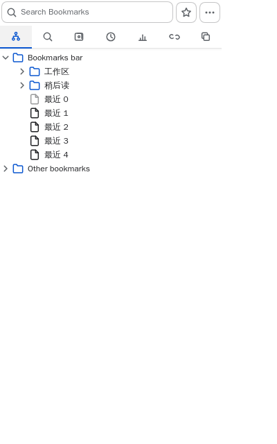
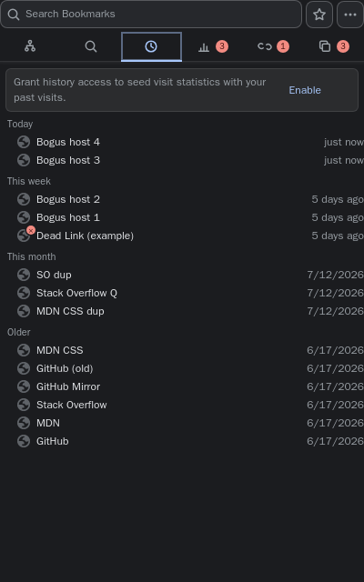
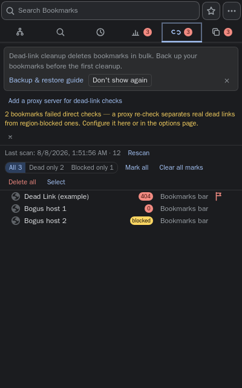
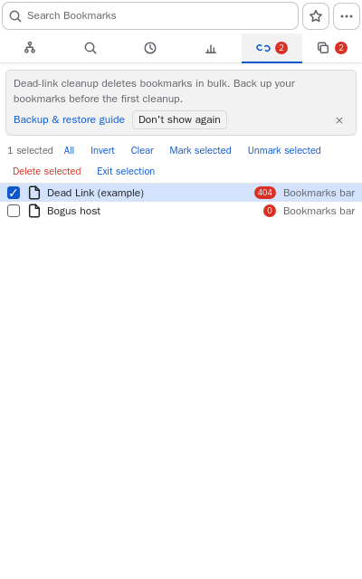
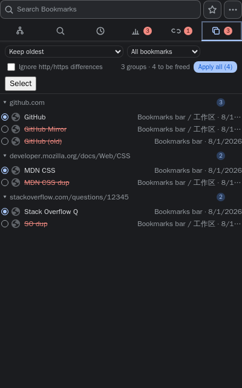
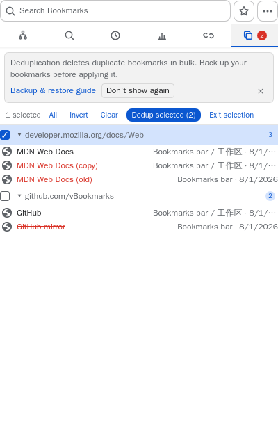
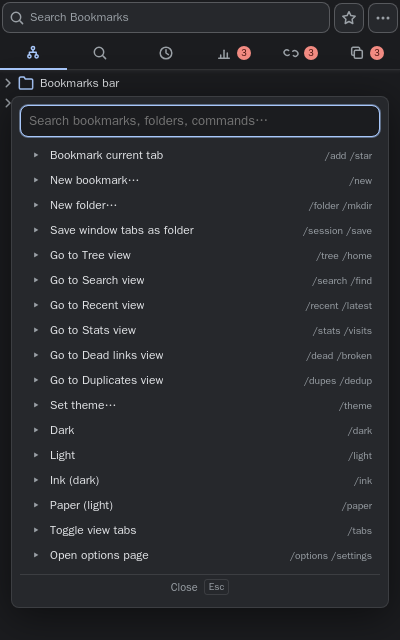
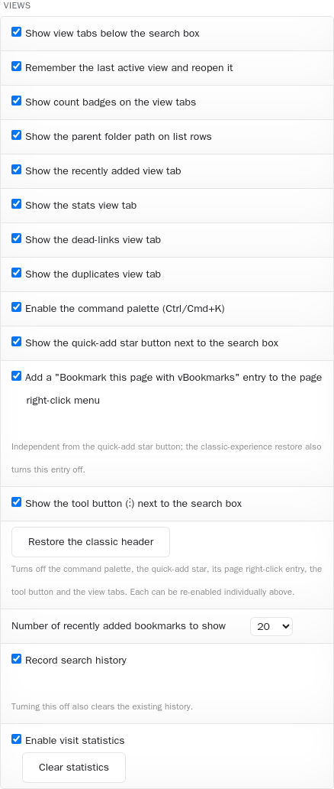

# vBookmarks 4.0 Feature Guide

> [中文版](guide-v4.zh.md) | Applies to 4.0 (Chrome 114+).
> Covers: the view system, the full keyboard model, a per-view walkthrough, the command palette, **how to get the classic look back**, and settings backup.

## Contents

1. [The view system](#1-the-view-system)
2. [Full keyboard reference](#2-full-keyboard-reference)
3. [The views, one by one](#3-the-views-one-by-one)
4. [Command palette](#4-command-palette)
5. [Getting the classic look and feel back](#5-getting-the-classic-look-and-feel-back)
6. [Settings backup & migration](#6-settings-backup--migration)
7. [Privacy notes](#7-privacy-notes)

---

## 1. The view system

4.0 grows the popup from "one tree" into **six views** behind an icon tab strip:



| View | What it does | Jump key |
|---|---|---|
| Tree | The classic hierarchical bookmark tree (startup view) | `Ctrl/Cmd+1` |
| Search | Dual-zone search: history on top, results below | `Ctrl/Cmd+2` |
| Recent | Newest bookmarks, grouped Today / This week / This month / Older | `Ctrl/Cmd+3` |
| Stats | Local visit statistics + a recently-visited section | `Ctrl/Cmd+4` |
| Dead links | Dual-channel dead-link scanner with pause/resume | `Ctrl/Cmd+5` |
| Duplicates | Duplicate cleaner with six keeper strategies | `Ctrl/Cmd+6` |

(Tabs carry one 16px line icon per view plus a localized label; on narrow widths the label hides and the icon stays.)

- **Badges**: the count on a tab tracks that view's pressing items (dead marks, dupe groups, tracked pages), refreshed live; turn them off with *Show count badges on the view tabs* (`showTabBadges`).
- **Visibility**: Settings → the *Views* group hides Stats/Dead/Duplicates individually, or the whole strip — see [§5](#5-getting-the-classic-look-and-feel-back).
- **Popup vs side panel**: both reopen on the view you left — the popup because *Remember the last active view* (`rememberView`) is on by default (turn it off to always boot on the tree), the side panel (opt-in via `openInSidePanel`, `Alt+Shift+B`) always, ready to be an always-on workspace.

## 2. Full keyboard reference

4.0 uses **one keyboard model everywhere**: the muscle memory from the tree works identically in the five other views, and the model re-flows itself over your settings — hide the tab strip, disable views or header buttons, and every key keeps working on what remains, nothing to relearn. The complete design (laws, Esc layering, the option-combination matrix) lives in [keyboard-model.md](keyboard-model.md); this section is the practical manual.

### 2.1 Focus zones

Arrow keys walk the popup exactly the way the eye scans it — `↓`/`↑` move between visual layers, `←`/`→` move along the current one:

```
┌ Header: search box → ☆ quick-add → ⚙ tools ┐  ←/→ walk the row · ↓ to the tabs
├ (banner, only while shown — Tab reaches it) ┤
├ Tab strip: six view tabs                    ┤  ←/→ switch · ↑ box · ↓ next rung
├ Toolbar: atop Stats/Dead/Duplicates         ┤  ←/→ walk controls · ↑ tabs · ↓ list
├ List: the active view's rows                ┤  ↑ past the top → toolbar (or tab)
└─────────────────────────────────────────────┘
```

- **`↓` in the search box** lands on the current tab; **`↓` again** enters the next rung down: Stats/Dead/Duplicates stop at the **in-list toolbar's** first control first, and only a further `↓` enters the list (at its remembered row); the tree/search/recent views have no toolbar and go straight to the list.
- **`↑` past the first row** crosses to the toolbar (to the current tab when there is none); **`↑` on the toolbar** reaches the tab; **`↑` again** the search box. (Hiding the tab strip flows the chain through the remaining rungs directly.)
- **`←`/`→` on the toolbar** walk every usable control in reading order and stop at the edges (RTL mirrors). **Native control semantics win**: a `<select>` (the Duplicates strategy/scope) keeps `↑`/`↓` for changing its option — leave it with `←`/`→`; on buttons and checkboxes `↑`/`↓` leave the rung.
- The toolbar re-renders together with the list (sort toggles, scan progress, regrouping) — **focus is restored in place**, never lost.
- **`→` on the header row** — once the caret is at the end of the text — leaves the box for the quick-add star, then the tools button; **`←`** walks back and parks the caret at the end, ready to type. RTL locales mirror both.
- **`Tab` works too**: `Tab` / `Shift+Tab` cycle the same regions — header controls → the banner's buttons (only while it is up) → tab strip → the active view's in-list toolbar (Stats sort, Dead scan controls, Duplicates strategy) → the list rows — then wrap around. Menus, dialogs and the palette keep their own local `Tab`.
- **Focus memory**: leaving a list for the tab strip or header and coming back lands on the row you left, not the top.
- **Search view exception**: in the search view the box is the view's own head — `↓` with a query jumps straight into the results (with an empty box, into the history rows; `↓` past the last history row crosses into the kept results). `↑` past the top of either zone still takes the universal crossing: tab strip, then box.

### 2.2 Universal keys (tree + every list view)

| Key | Action |
|---|---|
| `↑` `↓` | Move the selection (past the first row, `↑` crosses to the view's toolbar, or the tab strip) |
| `Home` / `End` | First / last row (Mac: `Cmd+↑` / `Cmd+↓`) |
| `PageUp` / `PageDown` | Scroll one viewport |
| `Enter` / `Space` | Open (`Ctrl/Cmd+Enter` new tab; `Shift+Enter` new window) |
| `→` | Open the row's context menu (on a tree folder: expand first) |
| `←` | Close the context menu (on a tree folder: collapse / go to parent) |
| `F2` | Rename / edit |
| `Delete` | Delete — **undoable** (toast → Undo; non-empty folders ask first) |
| Letters/digits | Tree & search views: type-ahead filtering (500 ms rolling buffer) |
| `Ctrl+F` | Focus the search box |
| `Esc` | Layered exit, see §2.4 |

### 2.3 View-specific and jump keys

| Key | Where | Action |
|---|---|---|
| `R` | Search/Recent/Dead/Duplicates | **Reveal in tree** |
| `K` | Duplicates | Pin the focused row as the group's **keeper** |
| `M` | Dead links | Toggle a **dead mark** (the red ✕ syncs across all views) |
| `Ctrl/Cmd+1…6` | Anywhere | Jump to the view |
| `Ctrl/Cmd+K` | In the popup | Command palette |
| `Ctrl/Cmd+Shift+K` | Global (any page) | Raise the popup with the palette open |
| `Ctrl/Cmd+D` | In the popup | Quick-add the current page (opens the edit dialog if already bookmarked) |
| `Alt+Shift+S` | Global (any page) | Quick-add the current tab straight into the quick-add folder |
| `Alt+Shift+B` | Global | Open the side panel |

On the tab strip itself: `←` `→` switch and activate (mirrored automatically in RTL locales), `Home`/`End` jump to the ends, `↑` to the search box, `↓` into the view's toolbar (or the list when there is none).

### 2.4 The Esc layer cake

`Esc` always peels exactly one layer, never everything:

```
context menu → banner (dismiss = "Later") → command palette
             → view-level action (Dead: pause/resume the scan;
             Dead/Duplicates: exit selection mode) → clear the search query
             → back to the tree → close the popup
```

Example: one `Esc` during a dead-link scan pauses it (press again to resume) — your search query is untouched.

### 2.5 Palette keyboard

`↑↓` select; `Enter` executes; `→` opens the context menu on bookmark rows; keep typing to narrow; `Esc` closes. Clicking elsewhere closes it automatically.

## 3. The views, one by one

### 3.1 Search — the dual zone


- **Top zone · recent searches** (MRU 10): each row shows the query, its result count and a relative timestamp.
  - Recorded only at meaningful moments (no prefix spam): pressing `Enter` to search, opening a result, or leaving the view.
  - **Re-run**: click, press `Enter` on a selected row, or `→` / right-click → *Search again*.
  - **Remove**: the row's `×` (revealed on hover/focus), the `Delete` key, or the `→` context menu; the header's *Clear* wipes all.
- **Bottom zone · results**: leave the view and come back — the query, the results and the scroll position are **all still there**.
- Related settings: `searchAfterEnter` (search on Enter instead of live), `searchHistoryEnabled` (off = stop recording **and wipe the stored history**).

### 3.2 Recent



- Newest bookmarks grouped **Today / This week (7 d) / This month (30 d) / Older**; a relative-time badge on the right, and `path · exact time` as the tail label (narrow) or second line (wide).
- Row count is configurable (10/20/50/100, default 20).
- `R` or right-click → *Reveal in tree* jumps to the bookmark's real position. With *Show only the bookmarks bar* on and the target outside the bar, a hint toast explains instead of failing silently — its *Show all and reveal* action shows the full tree for the session and completes the jump.
- A banner about the history permission may appear: that's the optional one-time import (see §3.3) — enable it or dismiss it; the view works either way.

### 3.3 Stats


- **Where counts come from**: ① bookmarks you open from this extension (popup/panel/search/any view); ② a background collector that notices navigations to bookmarked URLs from anywhere else — deduplicated, so one open never counts twice.
- Rows show a count pill + a relative "last visited"; sort by **count** or **recency** (persisted).
- **Recently visited section** (optional): reads Chrome history; bookmarked rows wear a ★, everything else has a one-click ☆ to file it. Every row carries the absolute visit time (sharing the second line with the path on wide layouts; the relative-time badge stays on the right). First use requests the optional `history` permission — decline and the section simply never appears.
- **Privacy switches**: turning off *visit statistics* stops all recording instantly; both the view footer and the options page have a confirm-gated *Clear statistics* button.

### 3.4 Dead links



- **Start**: the empty state tells you how many bookmarks will be scanned. Results **stream in row by row**.
- **Control**: `Esc` pauses/resumes without losing progress; canceling restores the last completed snapshot; reopening the popup paints the previous results instantly.
- **Dual channel**: direct fetch first; on failure your own **proxy template** (options page → *Dead scan* group; empty = direct only) gets the final say. **Dead** (red) and **Blocked** (amber) are different badges — "down for everyone" vs "just blocked here".
- **Filter**: All / Dead only / Blocked only.
- **Marks**: `M` or the row button flags a link; the red ✕ follows it into the tree, search, recent and stats views. Bulk mark/unmark lives in the toolbar (confirm-gated).
- **Selection mode**: the toolbar's *Select* swaps the idle controls for a batch bar — *All / Invert / Clear* over the filtered rows, then *Mark selected* / *Unmark selected* in one shot (no extra confirm: the explicit selection is the confirmation). `Esc` exits the mode.


- **Tuning** (options page → *Dead scan* group): concurrency 1–16 (default 4), timeout 2–30 s (default 8).

### 3.5 Duplicates



- **What counts as a duplicate**: URLs are normalized before grouping — tracking parameters (`utm_*`/`fbclid`/`gclid`) stripped, `#hash` dropped, root trailing slash folded; the toolbar's *Ignore http/https differences* checkbox merges scheme variants.
- **Keeper strategies** (toolbar select, six): oldest / newest / bookmark-bar / shortest title / shallowest / most-visited (live counts from the Stats view; greyed out while stats are off).
- **Manual pinning**: the row radio or `K` — manual picks survive strategy changes.
- **Inside an expanded group**: `Enter`/`Space` opens that copy, `←` jumps back to the group head. The group head's own context menu (right-click or `→`) offers *Clean this group* and expand/collapse.
- **Selection mode**: the toolbar's *Select* switches to a batch bar over whole groups (*All / Invert / Clear*); *Dedup selected* cleans every chosen group after a single confirmation. `Esc` exits the mode.


- **Preview first, execute after**: everything but the keeper renders struck-through; the group `×` (clean this group) or *Apply all* commits. Batch deletion runs through the **undo chain** and ends in a single summary toast.
- Scope can be limited to the bookmarks bar; the last result set is snapshotted — reopening paints instantly and re-validates in the background.
- Long group URLs are **mid-truncated** (both ends stay visible); the full URL lives in the tooltip.

## 4. Command palette



- **Open**: `Ctrl/Cmd+K` in the popup; `Ctrl/Cmd+Shift+K` from any page (raises the popup with the palette pre-opened).
- **Three modes in one box**: plain text fuzzy-searches bookmarks *and* folders (Enter on a bookmark opens it, Enter on a folder **jumps to it in the tree**); a leading `/` lists slash commands (prefix-matched — `/d` shows `/dead` and `/dupes`); an empty query shows the full command table.
- **Command table** (every command has aliases): `/tree` `/search` `/recent` `/stats` `/dead` `/dupes` (view jumps), `/session` (save the window's tabs as a folder), `/options`, theme switches (e.g. `/dark`, or `/theme` to list all five), `/tabs` (tab-strip visibility), `/path` (row path labels).
- **Bridge row**: a plain query offers "Search in the search view for …" at the bottom — Enter runs it in the full search view.
- **Chrome around the box**: a × button inside the field clears the query (mouse-only, like the search box); a full-width close bar sits at the bottom center for mouse users — the keyboard way out is `Esc`.
- The palette closes itself when it loses focus; `Esc` peels layers as usual.

## 5. Getting the classic look and feel back

Every new surface in 4.0 can be switched off. **The fastest route**: the *Restore the classic header* button in the options page's *Views* group — one click turns off the command palette, the quick-add star, the tool button and the view-tab strip, and each piece can be re-enabled individually right above it. For finer control, use this recipe:

| You want | Setting (options page → *Views* group, unless noted) |
|---|---|
| No tab strip — one tree + `Ctrl+F` search (the 3.x layout) | Turn off **Show view tabs** (`showViewTabs`). Tree and search remain the only views, shortcuts unchanged |
| An even quieter strip | Individually hide Stats/Dead/Duplicates (`showStatsView`/`showDeadView`/`showDupesView`) or Recent (`showRecentBookmarks`) — the tab, its `Ctrl+number` jump and its palette command all disappear |
| No command palette | Turn off **Enable the command palette** (`paletteEnabled`) — `Ctrl/Cmd+K` and the global wake-up both stand down |
| No quick-add star or tool button | Turn off `quickAddEnabled` / `showToolButton` in the Views group |
| Always open on the tree | Turn off **Remember the last active view** (`rememberView`) |
| No count badges on the tabs | Turn off **Show count badges on the view tabs** (`showTabBadges`) |
| Classic colors | General → theme: **Light** or **Dark** (Ink/Paper are the new 4.0 faces; Auto follows the OS) |
| No search history | Turn off **Search history** (`searchHistoryEnabled`) — recording stops and stored entries are **wiped** |
| No visit statistics | Turn off **Visit statistics** (`statsEnabled`) — recording stops; *Clear statistics* erases what's stored |
| No path labels on rows | Turn off **Show item path** (`showItemPath`) |
| Search on Enter only (a 3.3-era habit) | General → `searchAfterEnter` |
| Don't remember popup state | General → uncheck *Remember previous state* (`dontRememberState`) |
| Fixed popup height | General → turn off auto-resize (`autoResizePopup`) |

Want it even closer? The options page's **Custom Styles** group gives you full CSS control (e.g. `* { font-family: Consolas; }`), and the *Custom Icon* group replaces the toolbar icon with your own. Every setting applies instantly — no restart needed.



## 6. Settings backup & migration

The **Backup** group at the bottom of the options page:

- **Export**: downloads every setting (including the sync-area sync preferences) as a date-stamped JSON file.
- **Import**: pick a previously exported file; after confirmation it merges — keys present in the file are overwritten, everything else is kept. Export once before switching machines or reinstalling the browser.

## 7. Privacy notes

- Everything (bookmark caches, visit statistics, search history, dead/dupe snapshots) lives in the browser's local storage. Nothing is sent anywhere.
- Visit statistics can be paused (`statsEnabled`) and erased at any time; search history can be disabled and wiped.
- The `history` permission is **optional** and only requested when you enable the recently-visited section / history import; declining simply hides that section.
- The dead-link scanner only fetches your bookmarked URLs (and your own proxy template, if configured).
